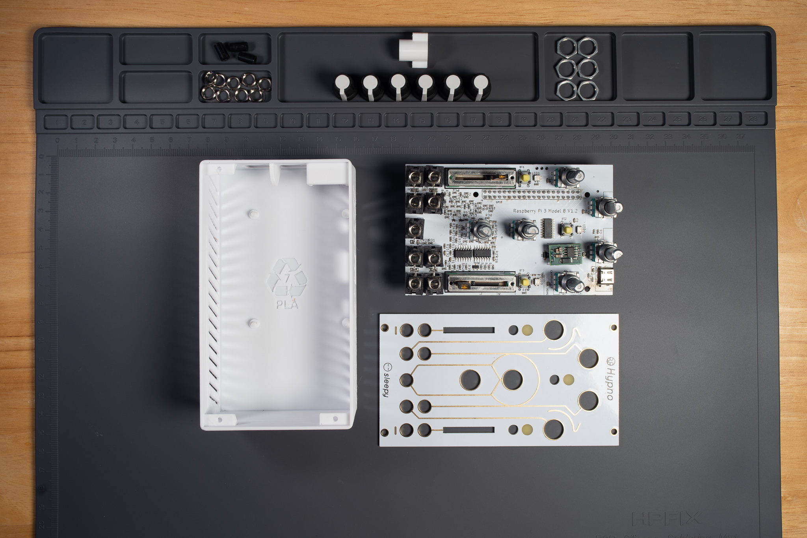
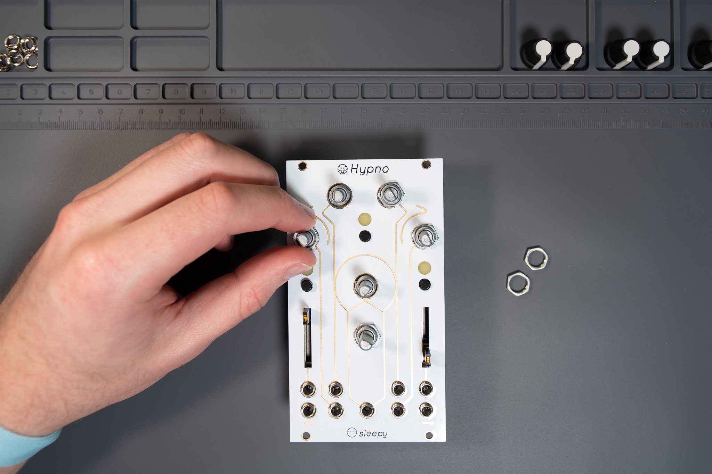
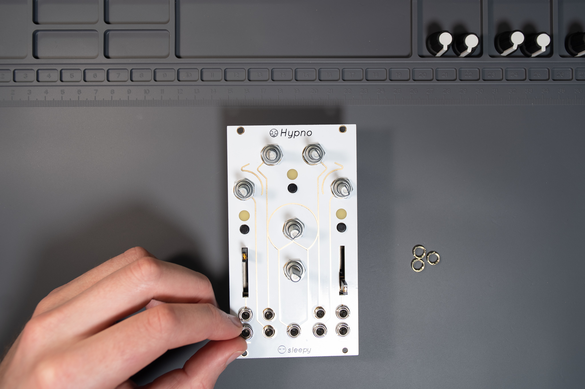
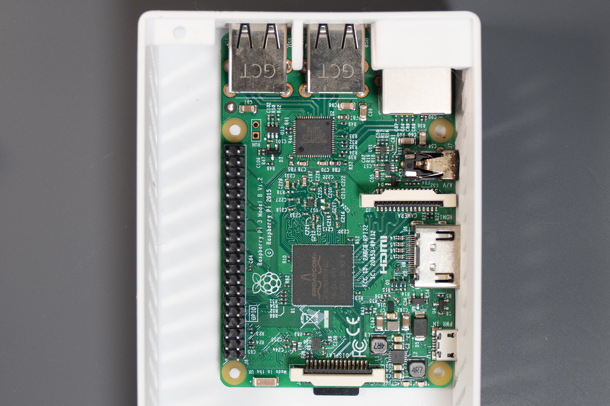
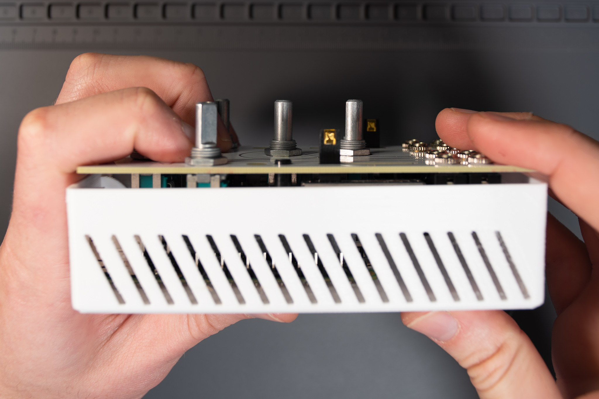
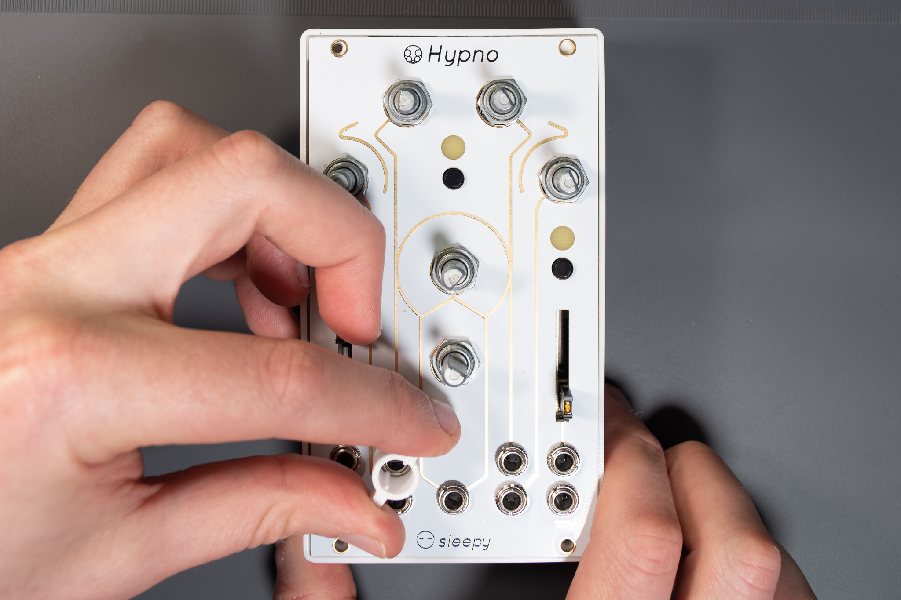
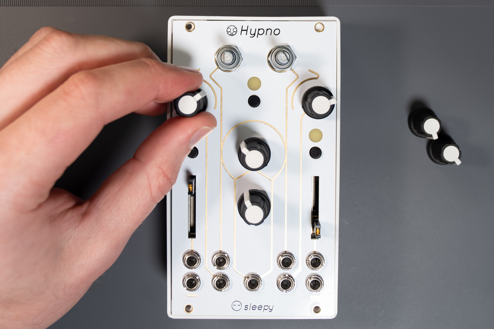

# Hypno Kit Assembly Guide (OLD/DIY)


**Please read this page completely before beginning assembly!**



**In Trouble?** Post on [our forum](https://forum.sleepycircuits.com), ask the [chat ](https://forum.sleepycircuits.com/t/new-beta-chat-room-via-matrix/554)or contact support@sleepycircuits.com


## Video Assembly Guide



## Setting up your Workspace


**PRACTICE STATIC AWARENESS:** This assembly requires you to handle electrostatic-sensitive parts. Failure to follow these recommendations will result in part failure that is not covered by manufacturer warranties.

* **Touch metal** to discharge any static buildup BEFORE handing any Circuit Boards (PCBs)
* **Handle circuit boards by their edges!**
* **Avoid** completing any of these steps on **carpet** or while wearing **fluffy clothing.** These materials tend to charge humans with static.
* **Use a static mat and wristband** if available


## Part Lists

### **Kit Provided Part List**


**Please Note:** Cases are sold separately on the site so you can select the correct one for your Raspberry Pi version! A case is **required** to complete this project.



#### Purchase your Kit and Enclosure Here: [https://sleepycircuits.com/hypno-kit](https://sleepycircuits.com/hypno-kit)




* Hypno Kit PCB&#x20;
* Hypno Panel
* 6x Knobs
* 3x Button Caps
* Plastic Jack Nut Driver&#x20;
* 9x Jack nuts&#x20;
* 6x Pot Nuts
* Plastic Enclosure (Pi 3 version shown above)


Pot Nuts may be threaded to the Pot-Shafts on the PCB Assembly when you receive your Hypno Kit.&#x20;


### User Acquired Part List


* [ ] 16GB (or greater) micro SD card (choose higher quality SDs for better performance)
* [ ] USB-C 3A PSU&#x20;
  * [Chicago Dist](https://chicagodist.com/products/raspberry-pi-4-psu-us-white?pr_prod_strat=copurchase\&pr_rec_pid=3855112208463\&pr_ref_pid=225528933\&pr_seq=uniform)
  * [Amazon](https://www.amazon.com/Raspberry-Model-Official-SC0218-Accessory/dp/B07Z8P61DQ/ref=sr_1_5?dchild=1\&keywords=Raspberry%2BPi%2B4%2BPower%2BSupply%2Bin%2BWhite\&qid=1632168811\&sr=8-5\&th=1)
* [ ] Raspberry Pi 3B, 3B+ or 4B
  * [USE THIS TOOL TO FIND ONE IN STOCK](https://rpilocator.com)
  * The 4B has several RAM options. **They all work**, so try to find the most affordable one. **There is no advantage of buying a higher RAM model** for use with the Hypno.
  * 3A and 3A+ are also compatible, although we do not yet offer an enclosure for these variants.
  * Pi Zero, Compute Modules (aka CM) and other Pis not listed above are **not compatible** with Hypno Ki&#x74;**.**
* [ ] [Sleepy Hypno Kit](https://sleepycircuits.com/hypno-kit) (full part list above!)
* [ ] A Computer to Flash SD Card With


Everything is Here? Lets Go!


## Flash SD Card (Load Firmware)

1. Insert micro SD Card Into your Computer
2. Download latest [**Hypno Image**](../hypno/hypno-firmware.md#firmware-images)&#x20;
3. Extract .gz archive (Optional but speeds up flashing significantly)
4. [Install Balena Etcher](https://www.balena.io/etcher/)
5. Start Balena Etcher
6. Open downloaded .img in Etcher and follow the instructions to flash micro SD card
7. You may skip the disk verification step


Careful! Removing the micro SD card before flashing & ejection is complete may mess up your image or, in some rare cases, brick your SD.


## Connecting WiFi (Optional)


Do this to enable streaming [NDI](https://ndi.tv/tools/#download-tools) on your [LAN](https://en.wikipedia.org/wiki/Local_area_network). Performance varies with network reliability.


* **Insert micro SD card into your computer** (for a fresh new micro SD card created with Etcher, you have to eject and insert it again)
* **Create a new file on micro SD card in the /boot/ directory called wpa\_supplicant.conf** with your computer
  * The basic text editor from your operating system is recommended (Notepad, TextEdit etc.).&#x20;
  * Make sure the file has the .conf extension, sometimes your os will try to add a .txt extension to the filename (wpa\_supplicant.conf.txt will NOT work! the filename has to be exact)
* **Copy/Paste the following lines in this file**&#x20;

```
country=US
ctrl_interface=DIR=/var/run/wpa_supplicant GROUP=netdev
update_config=1
network={
  ssid="YOURSSID"
  scan_ssid=1
  psk="YOURPASSWORD"
  key_mgmt=WPA-PSK
}
```

* **Replace variables with your SSID and password**, and **change the country value to your region** (Example above is for USA region)
* **Save the file to the /boot/ directory on micro SD card** with the name **wpa\_supplicant.conf**&#x20;

## <mark style="color:red;">**Assemble!!!**</mark>

.jpg>)

* Install button caps on Hypno PCB&#x20;
  * Line up square hole on button cap with square peg on button
  * Press button cap down until it slides over peg and locks in
* Place Front Panel on PCB Assembly&#x20;



* Hand tighten pot nuts (DO NOT OVER TIGHTEN, This may result in inoperable buttons in rare cases of very misaligned panels)


Pot Nuts may be threaded to the Pot-Shafts on the PCB Assembly when you receive your Hypno Kit.&#x20;


* Test button mechanicals
  * Feel a tactile feedback click when pressing down, if not shift panel relative to its plane or see before step.



* Hand screw jack nuts&#x20;
  * The little notches on the jack nuts should be facing towards you
  * We will fully tighten these later
* Place flashed micro SD card into Raspberry Pi



* Snap Pi into plastic case
  * Place Pi (Back USB IO first, headphone jack second) into the side of the case&#x20;
  * Firmly press down on outside corner of Pi
    * You should see plastic tabs fill the outside/left holes of the Pi when placed correctly&#x20;
    * You will most likely hear a snap when the Pi pressure fits into the enclosure, this is normal



* Align Hypno PCB on top of the Pi inside the enclosure&#x20;
  * Look through the vents in the plastic case to confirm header alignment
  * Gently press down on the center of the Hypno, it should smoothly slide onto the Pi's header
    * Please be careful not to break the header



* With Hypno placed on a flat surface, tighten  jack nuts with provided Jack Nut Driver, lightly pressing downward as you turn
* Add knobs to pot shafts (6x)




## Troubleshooting

* **Hypno isn't starting or working in the case** - Make sure to look through the vents in the plastic case to confirm header alignment or re do this part of the assembly, this is the most common issue in this situation.
* **Case Fit Issue - Top (or side) port section is bowing out** - go around the case and apply slight pressure around any ports that aren't seated all the way into their holes, once all the holes are all the way the case should fit just right.

## Setting Composite Video Output to PAL (or NTSC)&#x20;

* **This section concerns European Composite Users only, NTSC is enabled by default.**
* Modern Pi models combine the audio out and composite out on to the same 3.5mm jackplug. This requires a particular type of lead, with audio left on the tip, audio right on ring 1, ground on ring 2, and video on the sleeve. This is the same as leads used on Apple devices.
* If you require **PAL composite** output you will need to **replace sdtv\_mode in /boot/config.txt on the micro SD** with the following line

```
sdtv_mode=2
```

* OR If you require NTSC (this is the default configuration)

```
sdtv_mode=0
```

**If you require a more specific display mode** please consult [Pi's Official Documentation of /boot/config.txt Video Options](https://www.raspberrypi.org/documentation/computers/config_txt.html#video-options)
