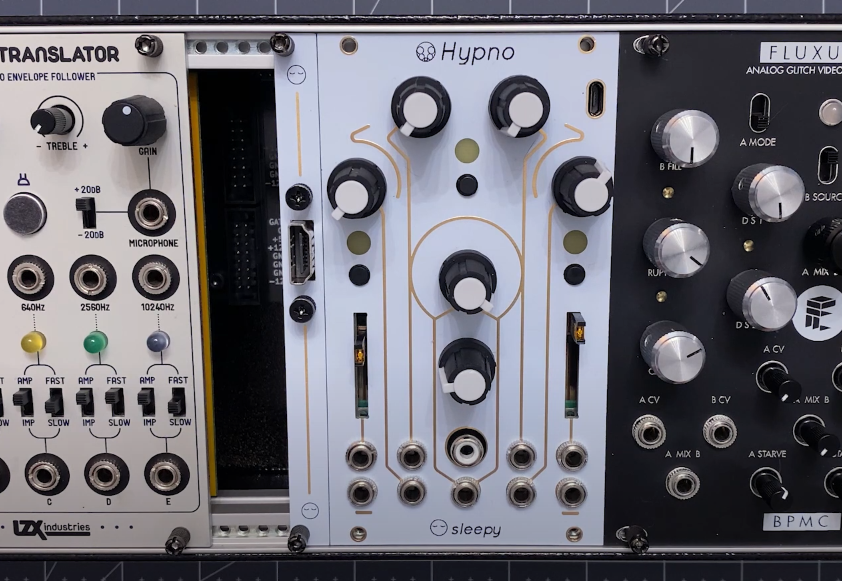
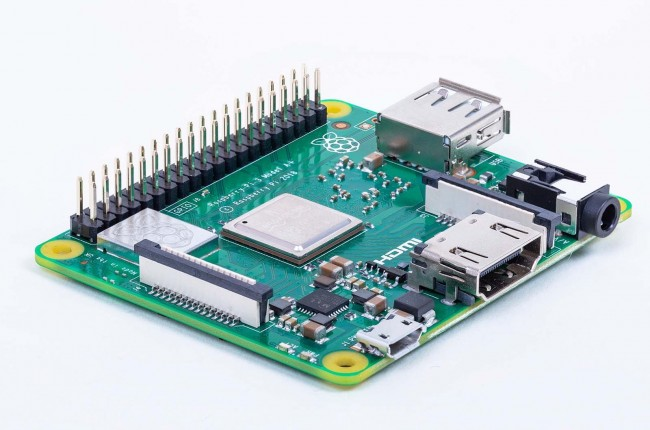

# Historical Hypno Versions, Expanders And Pi Variants

The Hypno is a modular device able to work with most Pis currently in production to allow for greatest supply flexibility and device availability.&#x20;

The different pis have a few hardware differences and wether you want to use your pi in the Eurorack will dictate which pi is best for your needs, the pi is user switchable and source-able by the user so keep in mind that acquiring a single setup does not prevent you from converting your Hypno to one that is best in the eurorack or vice versa.

## Hypno Pre-Built vs Kit Overview Chart

<table><thead><tr><th> </th><th width="201.8967305560172">Hypno Pre-Built 4B</th><th width="147">Hypno Kit</th><th>Hypno Pre-Built CM3</th></tr></thead><tbody><tr><td><strong>Eurorack Power</strong></td><td>With Eurorack Expander</td><td>With Eurorack Power expansion board</td><td>Yes</td></tr><tr><td><strong>Eurorack Mounting</strong></td><td>No</td><td>Possible with Pi3 A/A+ (EuroPower Expander required, output works best with HDMI Expander)</td><td>Yes</td></tr><tr><td><strong>CV</strong></td><td>7x CVs -5V-5V, 2x Trigger Inputs</td><td>No Difference</td><td>No Difference</td></tr><tr><td><strong>HDMI Output</strong></td><td>Side microHDMI x2</td><td>Side (accessible in Eurorack with HDMI Expander)</td><td>Side (accessible in Eurorack with HDMI Expander)</td></tr><tr><td><strong>Composite Output</strong></td><td>Raspberry Pi 4B requires 3.5mm TRRS to RCA dongle, CM4-WS Pi has no composite out</td><td>Pi 3.5mm TRRS to RCA dongle required (tends to be noisier)</td><td>Front Composite Output </td></tr><tr><td><strong>USB Data</strong></td><td>4x USB-A Port</td><td>4x USB A ports (depends on Pi)</td><td>1x Front MicroUSB (expandable via dongles &#x26; USB hub)</td></tr><tr><td><strong>USB Power</strong></td><td>USB-C Power</td><td>1x USB-C &#x26; 1x MicroUSB power port (depends on Pi)</td><td>2x MicroUSB power ports</td></tr><tr><td><strong>Networking / NDI</strong></td><td>Front USB acts as Ethernet device</td><td>Ethernet port, WiFi or Ethernet USB dongle (depends on Pi)</td><td>No Difference</td></tr><tr><td><strong>Processor</strong></td><td>Pi 4B</td><td>Pi3 B/B+, Pi4 B (see note about Pi3 A+ below)</td><td>Pi Compute Module 3 (identical processor to Pi3 A/B+) </td></tr><tr><td><strong>Plastic Case</strong></td><td>Compact (STL available)</td><td>Slightly deeper, vents for thermals (STL available)</td><td></td></tr><tr><td><strong>Software</strong></td><td>No Difference</td><td>No Difference</td><td>No Difference</td></tr></tbody></table>

## Hypno Prebuilt vs Kit

Hypno is available as a no-pi kit for you to bring your own pi, or as a Prebuilt (with whatever Pis Sleepy can acquire at the time).

### [Hypno Prebuilt](https://sleepycircuits.com/hypno)

The recommended no-fuss version of Hypno. Comes fully built and tested with PSU, SD and Pi available at the time of purchase. (Included Pi version is listed on the shop page)

### [Hypno No-PI Kit](https://sleepycircuits.com/hypno)

The kit comes with the basics needed to make your own Hypno unit with a user supplied pi and PSU. This includes a pre flashed SD card, enclosure and assembled Hypno main PCB.

## Hypno Expander Hardware

Hypno has a few expansion options mostly targeted at Eurorack users.

### [Hypno Eurorack Adapter Kit](https://sleepycircuits.com/hypno-euro-adapter-kit)

A 2hp panel and build directions for a way to break out your HDMI plug to a front panel in Eurorack.


[hypno-hdmi-expander-diy-project.md](hypno-hdmi-expander-diy-project.md)


### Hypno EuroPower Expander

A small board that mounts on the 6 pin header on the back of the Hypno PCB. This board converts the 12v eurorack power (10pin header) to the 5v that the Hypno requires.&#x20;

<em>Why is this component not part of the main Hypno PCB?</em> <strong>Shortages...</strong>

These components are offered separately because the power solution is subject to sudden supply changes (this allows us to only provide the required power parts to Eurorack users allowing better overall Hypno availability and lower pricing for Standalone users). If demand exceeds current part supplies we will simply update this PCB to use a different power solution.


When correctly mounted the sleepy logo should be facing away from you and NOT visible, otherwise the PCB will stick out and (if powered in this orientation) can potentially damage your unit!



Take care to plug in the Eurorack power ribbon in the correct orientation (red stripe facing up, this is also written and indicated on the PCB)


## All the PIs supported by Hypno and their Hardware Differences&#x20;


Track down & buy available PI hardware with [rpilocator.com](https://rpilocator.com)


### PI3 A+ (Best for Eurorack Users)

The A+ clears the Eurorack rails and allows mounting in the format.&#x20;

To power the Hypno with your Eurorack you will also need a [Hypno Eurorack Adapter Kit](https://sleepycircuits.com/hypno-euro-adapter-kit).

**Composite output** requires [an extra breakout dongle for the headphone jack](https://www.amazon.com/Adafruit-Composite-Video-Raspberry-ADA2881/dp/B06W2JXLSK/ref=sr_1_3?crid=6AL6A5ZL88JW\&keywords=raspberry+pi+trrs+cable\&qid=1654633577\&sprefix=raspberry+pi+trrs+cable%2Caps%2C131\&sr=8-3) but[ this generic HDMI to Composite Box](https://www.amazon.com/Converter-Composite-Adapter-Supports-Chromecast/dp/B08CH91V1W/ref=sr_1_8?crid=31ZBA96VMF08Z\&keywords=hdmi+to+composite\&qid=1654633998\&sprefix=hdmi+to+composite%2Caps%2C174\&sr=8-8) is also a good way to get Composite out.


Standalone Note: The Hypno Enclosure is made to support all the PIs at once so **the A+ USB port is inset a bit deeper into the enclosure** and harder to access when used standalone. For this reason we recommend using the other Pis if youre primarily looking to use Hypno standalone.


### PI4 (Best for Standalone Users)

The most modern pi, we recommend using this for your Hypno if available. This version uses micro HDMI for output so an extra "Micro HDMI to HDMI" dongle is required to connect the common full size HDMI plug.


PI4 comes in a few different RAM configurations, all RAM configs work with Hypno.



Composite output on Pi4 requires [an extra breakout dongle for the headphone jack](https://www.amazon.com/Adafruit-Composite-Video-Raspberry-ADA2881/dp/B06W2JXLSK/ref=sr_1_3?crid=6AL6A5ZL88JW\&keywords=raspberry+pi+trrs+cable\&qid=1654633577\&sprefix=raspberry+pi+trrs+cable%2Caps%2C131\&sr=8-3) and a few config adjustments (See [Hypno Manual](https://sleepycircuits.gitbook.io/sleepy-circuits/hypno/hypno-manual#switch-to-composite-hdmi-on-kit-with-pi4)) (Or just use [converter box](https://www.amazon.com/Converter-Composite-Adapter-Supports-Chromecast/dp/B08CH91V1W/ref=sr_1_8?crid=31ZBA96VMF08Z\&keywords=hdmi+to+composite\&qid=1654633998\&sprefix=hdmi+to+composite%2Caps%2C174\&sr=8-8))


### PI3

The original Pi hardware Hypno is built on. The engine is optimized for this hardware to make sure compatibility across all Pi versions. Most notably, this one has a full-size HDMI output so does not require extra dongles.


The biggest con of this configuration is that it still uses the micro-USB plug for power on the side which sometimes suffers from poor mechanical mating, this is avoidable by using the USB-C power plug on the Hypno PCB and how we recommend powering your Pi3 based Hypno.



Composite output requires [an extra breakout dongle for the headphone jack](https://www.amazon.com/Adafruit-Composite-Video-Raspberry-ADA2881/dp/B06W2JXLSK/ref=sr_1_3?crid=6AL6A5ZL88JW\&keywords=raspberry+pi+trrs+cable\&qid=1654633577\&sprefix=raspberry+pi+trrs+cable%2Caps%2C131\&sr=8-3). (Or just use [converter box](https://www.amazon.com/Converter-Composite-Adapter-Supports-Chromecast/dp/B08CH91V1W/ref=sr_1_8?crid=31ZBA96VMF08Z\&keywords=hdmi+to+composite\&qid=1654633998\&sprefix=hdmi+to+composite%2Caps%2C174\&sr=8-8))


### PI CM4 w/ WS-IO&#x20;

If one cannot source any of the above pis you can use the Pi CM4 with the [Waveshare CM4IO-BASE-B](https://www.waveshare.com/product/cm4-io-base-b.htm). This config results in a nice clean IO setup with all ports facing the back of the Hypno.


We have found that updating this version[ requires rpiboot](https://github.com/raspberrypi/usbboot) in some configurations (See [hypno-firmware.md](../hypno/hypno-firmware.md "mention") for details)



Attention Analog Fans: This config **does not have a composite output**. (But you can just use [this generic HDMI to composite converter box](https://www.amazon.com/Converter-Composite-Adapter-Supports-Chromecast/dp/B08CH91V1W/ref=sr_1_8?crid=31ZBA96VMF08Z\&keywords=hdmi+to+composite\&qid=1654633998\&sprefix=hdmi+to+composite%2Caps%2C174\&sr=8-8))


The CM4 module (displayed below) should be placed into the receiver on the above CM4-IO-BASE)

CM4 Compatibility (w/ Serial Numbers)

**List of Preferred Compatible CM4s (with sufficient onboard storage and WiFi)**

CM4101016, CM4101032, CM4102016, CM4102032, CM4104016, CM4104032, CM4108016, CM4108032

**List of Compatible CM4s that require a microSD card**

CM4101000, CM4102000, CM4104000, CM4108000

**List of Compatible CM4s that do not have built-in WiFI**

CM4001016, CM4001032, CM4002016, CM4002032, CM4004016, CM4004032, CM4008016, CM4008032

**List of Compatible CM4s that require a microSD card and do not have built-in WiFI**

CM4001000, CM4002000, CM4004000, CM4008000

**List of Incompatible CM4s ( <8GB eMMC)**

CM4001008, CM4101008, CM4002008, CM4102008, CM4004008, CM4104008, CM4008008, CM4108008

