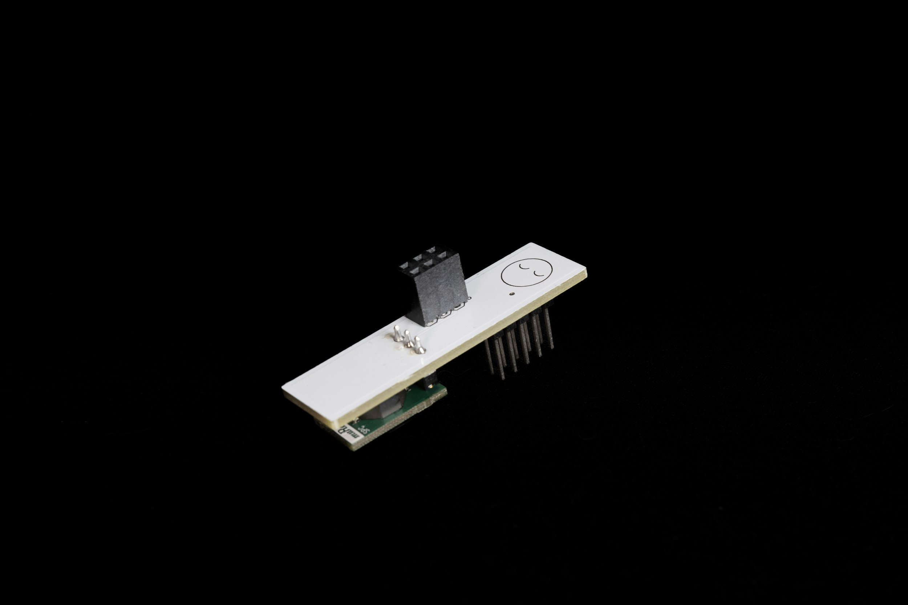
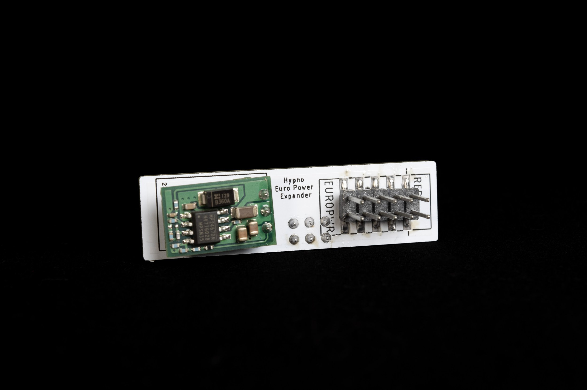

# Hypno Eurorack Adapter Kit Assembly Guide

<figure><figcaption></figcaption></figure>

## Part List

<figure><figcaption></figcaption></figure>

1\. HDMI Expander Panel

2\. Behind the Panel HDMI Ribbon

3\. HDMI Panel mount adapter

4\. Eurorack Screws

5\. Euro Power Expander Board

6\. Eurorack Ribbon (Not shown)

## HDMI Expander

### Video Assembly Guide




**Please read this page completely before beginning assembly!**



**In Trouble?** Check out the [related thread on sleepy forum.](https://forum.sleepycircuits.com/t/hypno-hdmi-expander-diy)


### Part Lists

* [HDMI Female to Female Panel Mount Adapter](https://www.amazon.com/Extension-Extender-Coupler-Adapter-CableCC/dp/B00ZUEC36K/)
* [HDMI Male to 90 Degree Down Angled HDMI Male Flat Cable ](https://www.amazon.com/gp/product/B01EWSKVDQ)
* M3 (or similar) machine/computer screws
* [Sleepy Circuits HDMI Expander Panel (2hp)](https://sleepycircuits.com/hypno-expander-panel)

### Assembly Directions

1. Slide the connector from the flatter end of the HDMI panel mount adapter through the cutout in the expander panel. The orientation of the adapter is reversible.

.png>)

2\. Secure the HDMI panel mount adapter to the expander with two M3 (or similar) screws.

.png>)

3\. Assemble the flat HDMI cable by gently opening the plastic clasp on both of the HDMI connectors and inserting the ribbon cable with the exposed pins facing down, then close the clasps.

.png>)

.png>)

4\. Plug the straight connector from the flat HDMI cable into the rear of the panel mount adapter.

.png>)

5\. Plug the 90 degree connector from the flat HDMI cable into the HDMI port on Hypno.

.png>)

6\. Mount the expander panel on the left side of Hypno. The vertical orientation of the panel is reversible.

.png>)


The resulting DIY expander is about 55mm in depth, so it may not fit in all cases!


## Euro Power Expander Board

<figure><figcaption></figcaption></figure>

<figure><figcaption></figcaption></figure>

### Assembly Directions

1. Start with your Eurorack PSU off
2. Put the assembled expander on the back 6 pins of the Hypno (sleepy logo away from you, you shouldn't see it when looking at the Hypno from the back when placed correctly)&#x20;

<figure><figcaption></figcaption></figure>

<figure><figcaption></figcaption></figure>

3\. Plug in the eurorack ribbon.&#x20;

**IMPORTANT: Make sure to align the red stripe graphic when plugging in the ribbon**

<figure><figcaption></figcaption></figure>

4\. Turn on Eurorack psu and make sure the kit is able to boot and stay on under load (about a minute of the engine running)**.**&#x20;

5\. Make sure no lighting bolt appears on the top right corner of the screen (this indicates an undervoltage issue). &#x20;
