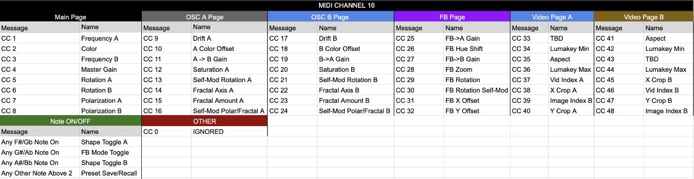

# Hypno Troubleshooting Guide

## 1. Power and Boot

### Power Requirements

Hypno requires power from either the USB ports or your Eurorack case and will begin booting as soon as power is supplied. Hypno requires at least 2A @ 5V for USB power, or 330mA on the +12V rail from a Eurorack power supply. When using USB accessories such as UVC devices we recommend providing Hypno with 3A @ 5V for USB, and 500mA for +12V Eurorack power. Hypno can receive USB power from either its top USB-C port. For Hypno Kit we recommend you use the official Raspberry Pi3 Amp USB-C PSU plugged in to the Hypno Kit's rear USB-C port.&#x20;

### **Hypno does not boot or turn on**

* Isolate Hypno from all accessories (capture devices, MIDI controllers, etc.) before powering.
* **Hypno Original (CM3+):** Ensure that the rear panel UPDATE switch is in the down position. Hypno will not boot if the switch is in the UPDATE position. Hypno displays one faint green LED when powered on in update mode.
* **Hypno Kit:** Re-flash firmware onto the SD
  * If this doesn't work try to use your raspberry pi with an image from[ Raspberry Pi Imager](https://www.raspberrypi.com/software/) to verify your Pi is functional and booting correctly

#### **\[For USB power]**

* Plug your USB power supply directly into a working wall socket, separate from any power strips.
* Use a USB power supply with a minimum of 2A @ 5V, or 3A @ 5V if using accessories with Hypno.
* Try another USB power supply.
* Try another microUSB or USB-C cable, preferably one less than 6’ long.

#### **\[For Eurorack power]**

* Verify your system’s power requirements and supply specifications to ensure you have enough power for all of your modules. Use [www.modulargrid.net](http://www.modulargrid.net/) to accurately plan your modular’s power needs, but make sure you leave some headroom as modular grid isn't 100% accurate, particularly with modules first powering on.&#x20;
* Ensure that the ribbon cable is seated properly with all pins connected and the red stripe (-12V) is oriented according to the PCB printing.
* Try another power header on your Eurorack bus board.
* Try another ribbon cable. Hypno uses a 10-pin to 16-pin style ribbon cable.
* Try powering Hypno using USB power instead

If you are unable to power Hypno after going through these steps, please contact support.

### Hypno reboots unexpectedly, does not stay on or freezes

* Isolate Hypno from all accessories (capture devices, MIDI controllers, etc.) before powering on

#### &#x20;\[For USB power]

* Plug your USB power supply directly into a working wall socket, separate from any power strips.
* Use a USB power supply with a minimum of 1A (1 amp) @ 5V. When using USB accessories, we recommend 2A (2 amps) @ 5 volts.
* Try a different USB power supply.
* Try a different microUSB cable, preferably one less than 6’ long.
* If using the front USB port for power, try using the side USB port instead.

#### \[For Eurorack power]

* Verify your system’s power requirements and supply specifications to ensure you have enough power for all of your modules. Use [www.modulargrid.net](http://www.modulargrid.net/) to accurately gauge your modular’s power needs.
* Ensure that the ribbon cable is seated properly with all pins connected and the red stripe (-12V) is oriented according to the PCB printing.
* Reseat the ribbon cable on the module and the bus board.
* Try a different power header on your Eurorack bus board.
* Try a different ribbon cable. Hypno uses a 10-pin to 16-pin style ribbon cable.
* Try powering Hypno using USB power instead, using the steps above

## 2. Updating Hypno

Hypno requires the Balena Etcher program to write new firmware images to the EMMC. Download the correct installation for your operating system from their website: [https://www.balena.io/etcher/](https://www.balena.io/etcher/)


The latest firmware images for Hypno can always be found at on the [Sleepy Docs Hypno Firmware Page](hypno-firmware.md).



Download the image that corresponds with your country’s broadcast standard (NTSC or PAL).


As of firmware 2.1, Hypno displays the firmware version on video output upon booting.

### **Update Procedure**

1. Download and install [Balena Etcher](https://www.balena.io/etcher/)
2. Download the [latest Hypno Image](hypno-firmware.md)
3. Extract .gz archive (optional but speeds up flashing significantly)
4. Remove Hypno from its enclosure. This video shows you how: [https://vimeo.com/472684965](https://vimeo.com/472684965). For Hypno DIY see [here](https://youtu.be/QfaHEeOPxZY?t=322) (and reverse the process shown).
5. Flip the switch on the rear left side of Hypno into the UPDATE position (not applicable for Hypno DIY)
6. Connect Hypno to a computer via the front USB port (for Hypno DIY insert MicroSD card into your computer).
7. Start Balena Etcher
8. Open downloaded .img in Etcher and follow the instructions (Hypno shows up as a “Compute Module” & may take a second to initialize)
9. Once flashing is complete, disconnect Hypno, put update switch into the down position (or eject SD card from computer and insert it into Hypno DIY) and power Hypno.

### **Hypno is not booting and only the right LED is glowing a faint green**

* Make sure the update switch is in the down position (not applicable for Hypno DIY)
* Cycle power (Hypno will not boot while in update mode)
* If using a Compute Module unit (CM3/4) make sure the compute module is securely connected to the rest of the board and did not come loose during transit

### **Compute Module does not initialize in Balena, or is not recognized by my computer**

* Ensure that Hypno is isolated from all accessories
* Connect Hypno directly to a computer using the provided USB-C cable with no hubs or adapters
* Try another USB-C cable (cables < 6’ are recommended)
* Attempt the update on another computer
* If none of the above helps, attempt the EMMC test described in Section 8

### **“Missing Drivers” error in Etcher on Windows:**

* In some cases, Windows users will need to install and run RPiboot for the Compute module to be recognized. Download RPiboot from the Raspberry Pi foundation: [https://github.com/raspberrypi/usbboot/raw/master/win32/rpiboot\_setup.exe](https://github.com/raspberrypi/usbboot/raw/master/win32/rpiboot_setup.exe)

[Contact us](https://sleepycircuits.com/contact) with any issues not described here, or if you need further assistance updating.

### **“Missing Drivers” error/ Compute Module not Recognized in Etcher on Mac:**

* Please follow the directions for building and using rpiboot found on this page: [https://github.com/raspberrypi/usbboot](https://github.com/raspberrypi/usbboot)

## 3. Video outputs

Hypno has built in HDMI digital video output on the top side of the module. The composite video can be standard definition NTSC or PAL (480i/576i). It is not possible to use both outputs simultaneously; Hypno will automatically use the HDMI output if it is connected to an active display on boot. If no display is detected, it will default to composite.


If you intend to use the Hypno HDMI output, please plug an HDMI cable into your display (TV, monitor, projector, caputre-card, etc...), power your display on, and plug the other end of the HDMI cable into the Hypno **before** powering the Hypno on.


### **No HDMI output, or HDMI output is garbled/has artifacts**

* Connect Hypno to an actively powered HDMI display or capture device before turning the module on
* Try another HDMI cable, preferably less than 15’ long
* Try another active HDMI display


**Composite on PI4** requires **enable\_tvout=1** in config.txt


### **No output (composite)**

* Ensure Hypno is not connected to an HDMI display, or else it will default to HDMI output. Only one hardware video output may be used at a time.

### **Composite output is garbled, has no color, or scrolls on the screen**

* Verify that Hypno and your TV are using the same television standard, NTSC or PAL. Firmware images are available for both, install the one that matches your display found [here](hypno-firmware.md).

## 4. NDI Output

Hypno is capable of broadcasting NDI video from its front micro USB port (or Ethernet/WiFi for properly equipped Hypno DIY). This allows you to capture, stream and monitor Hypno’s output directly on a Mac or PC without additional hardware. With no HDMI output connected, Hypno will output 720x480 over NDI. If the HDMI is connected, the NDI output resolution will match the resolution of the HDMI output.

Before continuing this section, see the [NDI Output](https://sleepycircuits.gitbook.io/sleepy-circuits/hypno/hypno-manual#ndi-output-+-spout-syphon) segment of the Hypno Manual.&#x20;


Hypno Kit built with a Raspberry Pi 4 will **not** initialize NDI unless an HDMI cable is connected and transmitting signal when the Hypno is powered on.


### **Windows Setup**

1. Install NDI 5 Tools.
2. Connect Hypno to your PC using a microUSB cable from the front USB port (or Ethernet/WiFi for properly equipped Hypno DIY) and allow Windows to automatically install drivers\*
3. Reboot your PC
4. Open NDI Tools “Studio Monitor”
5. Click the top left hamburger menu and select Hypno:main
6. Hypno should now be viewable from Studio Monitor

\*On some systems it is necessary to install the RNDIS driver. Please follow this detailed guide: [https://wiki.moddevices.com/wiki/Troubleshooting\_Windows\_Connection](https://wiki.moddevices.com/wiki/Troubleshooting_Windows_Connection)&#x20;

### **Mac Setup**

1. Install NDI 5 Tools for Mac (installer automatically installs Studio Monitor)
2. Connect Hypno to your Mac using a microUSB cable from the front USB port (or Ethernet/WiFi for properly equipped Hypno DIY) and allow your OS a moment to recognize the device
3. Open NDI Tools “Studio Monitor”
4. Click the top left hamburger menu and select Hypno:main
5. Hypno should now be viewable from Studio Monitor

### **Hypno is not viewable in Studio Monitor**

* Some USB ports may not deliver enough power for Hypno to run on alone. Try connecting Hypno to a separate power source, such as Eurorack power or the side USB port. Verify external power sources are suitable as described in Section 1.
* If you have an original Hypno (non-Kit), confirm that it is connected to your computer via the module’s front USB port. This is the only port capable of supporting data
* Try another cable, preferably less than 6’ long
* Disable VPNs and/or Firewalls.
* Hypno Kit built with a Raspberry Pi 4 will **not** initialize NDI unless an HDMI cable is connected and transmitting signal when the Hypno is powered on.

#### **\[For Windows users only]**

* Install the RNDIS driver, if you have not already done so [https://wiki.moddevices.com/wiki/Troubleshooting\_Windows\_Connection](https://wiki.moddevices.com/wiki/Troubleshooting_Windows_Connection)
* In some cases, disabling Windows Defender Firewall for Public Networks resolved connectivity issues. Not recommended when connected to public Wi-Fi networks (school, work, coffee shop).

Check out the discussion on NDI in Windows on our forum: [https://forum.sleepycircuits.com/t/ndi-obs-setup-troubleshooting-guide-for-windows/](https://forum.sleepycircuits.com/t/ndi-obs-setup-troubleshooting-guide-for-windows/165/)

Or NDI on Mac: [https://forum.sleepycircuits.com/t/ndi-obs-setup-troubleshooting-guide-for-mac/](https://forum.sleepycircuits.com/t/ndi-obs-setup-troubleshooting-guide-for-mac/)

## 5. UVC input (USB video input)

As of firmware revision 2.0, Hypno can accept video input from UVC compliant capture devices and webcams (USB 2.0, MJPEG compressed output) through its front micro USB port (or rear USB-A ports on properly equipped Hypno DIY). A USB OTG (microUSB adapter) cable is required to connect USB accessories (not for Hypno DIY). In general, Hypno should work with any webcam or capture card that is:

* UVC compliant
* USB 2.0
* Supports an MJPEG compressed output mode

NOTE: Regarding USB hubs, please use a supported hub and leave generous headroom in the available current of your power supply or hub, otherwise you may damage your device or peripherals.

### **UVC Setup**


UVC input is available on Hypno firmware 2.0 or later. We recommend always updating to the [latest version.](hypno-firmware.md)


1. Connect your USB 2.0 UVC device to a USB OTG cable (microUSB adapter) and plug this into Hypno’s front USB port (not applicable for Hypno DIY)
2. Hypno will automatically recognize compatible devices and switch Shape A to the video input
3. Transform controls for your shape remain intact and may be used to modify the video input
4. Extended controls for the video input, like luma keying and aspect ratio, are available using a new Page in the Hypno UI. This is detailed in the [manual](hypno-manual.md).

### **Hypno does not recognize UVC input (Shape A does not switch to video)**

* Verify the capture/webcam device is UVC compatible
* Install the [latest Hypno firmware](hypno-firmware.md) onto the module, as described in Section 2 of this manual.
* Connect your peripherals directly to Hypno using a USB OTG (microUSB) adapter, avoid using hubs.
* Test the capture card using a computer.
* Test the USB OTG adapter with another device, such as a USB webcam, USB MIDI controller, or different video capture card.
* In rare cases it may be necessary to reflash the Hypno firmware. See Section 2 for instructions.

#### \[For USB power]

* Try another power supply. We recommend a 2A 5V power supply or better when utilizing USB accessories.
* Try another USB cable, 6’ or shorter.

#### \[For Euroack power]

* Ensure that your case power is sufficient for Hypno. Hypno can require up to 500mA from the +12V rail when using video input. You can check your system’s power needs by using Modular Grid.
* Try USB power if you’re unable to eliminate your Eurorack power supply as a potential cause.
* Verify the capture card’s functionality using a computer.
* Test the USB OTG adapter with another device, if you have one. This can be a USB video capture device, a USB webcam, or a USB MIDI controller.
* In rare cases it may be necessary to reflash the Hypno firmware. See Section 2 for instructions.

### **Hypno recognizes UVC device (Shape A switches to video), but displays nothing or color bars only**

* Try another HDMI cable.
* Try another HDMI source.
* Ensure the source’s resolution is within the specifications of the capture device.
* Test the HDMI source on an HDMI display

We’ve compiled a running list of compatible USB accessories on the forum: [https://forum.sleepycircuits.com/t/list-of-usb-accessories-that-work-with-hypno/](https://forum.sleepycircuits.com/t/list-of-usb-accessories-that-work-with-hypno/)

## 6. MIDI

Hypno is equipped with USB-MIDI Host capability, meaning it can accept incoming MIDI CC (continuous controller) and note messages from Class Compliant USB-MIDI devices, such as MIDI keyboards and controllers, as well as some grooveboxes and synthesizers. Connecting a MIDI device requires a USB OTG (microUSB adapter) cable (not for Hypno DIY). Note that host to host MIDI connections, such as between Hypno and a computer, are not currently supported.

### Using the OP-Z to control Hypno with MIDI


How to use OP-Z with Hypno


### **Hypno does not respond to USB MIDI devices**

* Verify the MIDI device is capable of Class Compliant USB-MIDI
* Verify the MIDI device is transmitting on MIDI channel 16
* Verify the MIDI device is mapped to the correct CC parameters in the MIDI implementation chart
* Try another USB cable
* Try another OTG adapter (not applicable for Hypno DIY)
* Update Hypno to the latest firmware version. See Section 2.

### **MIDI Implementation Chart**

## 7. Hardware

Hypno is equipped with 6 knobs, 2 sliders, 3 buttons, 9 minijack inputs for CV. Hypno’s CV inputs accept a range of +5V to -5V, voltages above or below +/-5V range will be clipped. Incoming CV is summed with the parameter’s knob position.

### **How to remove CM3 Hypno from its enclosure**&#x20;


How take remove Hypno from its 3D printed enclosureFor Hypno DIY see [here](https://youtu.be/QfaHEeOPxZY?t=322) (and reverse the process shown).


For Hypno DIY see [here](https://youtu.be/QfaHEeOPxZY?t=322) (and reverse the process shown).

### **Using the Mother-32 to control Hypno with CV**


How to Create Audiovisuals with Moog Mother-32 and Hypno


### **Hypno’s sliders/knobs do not respond**

* Disconnect any CV sources from the corresponding knob
* Disconnect any MIDI devices
* Isolate Hypno from all other accessories
* Reboot Hypno

### **Hypno’s CV inputs do not respond**

* Change the position of the corresponding knob
* Try another patch cable
* Verify the CV source is sending CV by patching it to another module

### **Hypno’s parameters act erratically when CV inputs are used**

* Update Hypno to the latest firmware

### **Hypno’s parameters “jump” or “jitter” with no CV input, MIDI input, or movement of the knobs**

* Some units produced in Dec 2020 and before may experience a small amount of jitter due to a minor hardware flaw. Affected units are eligible for free repair under our voluntary recall. [Contact us](https://sleepycircuits.com/contact) for details.

### **Hypno has crashed or stopped responding**

* Reboot Hypno.
* If the issues persists, refer to Section 1 for power and boot troubleshooting.

### **Ground loops**

If you hear a buzz or hum when Hypno is connected to your computer, you may have a ground loop. Ground loops are a common cause of noise, hum, and interference in audio and video devices when interconnected devices are receiving power from separate sources. If you’re experiencing ground loop noise, some of the following suggestions may help you identify or eliminate the source.

* Plug your Hypno, computer, computer accessories, video capture devices, audio interface, CV devices, and anything else that is physically interconnected, into the same power strip/conditioner (provided that the power strip/conditioner has enough sockets and can safely supply the required power for the aforementioned devices).
* Power Hypno using an AC to USB power brick (USB wall outlet adapter), with at least 1A output, connected to the module’s side microUSB port.
* Power any audio interfaces through its mains connection, as opposed to USB bus power.
* If the noise is still present, try simplifying your setup until you pinpoint the culprit by process of elimination.
* USB ground loop isolators may help mitigate ground loops, especially if the device causing trouble in your system is battery powered with no means of direct mains connection.
* Additionally, you can help eliminate noise and other interference in your setup by using balanced audio cables wherever possible, power conditioners in place of power strips, and avoiding running audio or video cables parallel to power cables.
* Due to the complexity of audio-visual setups we can’t provide formal technical support for ground loops, but feel free to post about your issue in this thread if you need help.

## 8. Compute Module

### **CM3+ Initialization Test**

1. While Hypno is powered off, take the module out of its enclosure and flip the rear panel switch into the "UPDATE" position
2. While continuing to leave Hypno unpowered, connect the module to an active HDMI display (a TV or monitor that is currently ON) with a working HDMI cable.
3. Connect Hypno's front microUSB port to a Mac or PC and open Balena Etcher.
4. Load the[ Hypno firmware file](hypno-firmware.md) into Balena and select Hypno as the target, this will trigger the module to begin initializing.
5. You should see the rainbow splash screen and some messages scrolling in the console on your HDMI display connected to Hypno.

#### **If there is no output**

* Verify a powered display was connected BEFORE connecting Hypno to a computer, with no other power sources connected.
* Attempt to reseat the Compute Module using the directions below.

#### **If the console says “Error… whilst initializing MMC card”**

.png>)

* Attempt to reseat the Compute Module using the directions below.
* If that doesn't work and you are still getting the above error, your compute module may be defective please contact support@sleepycircuits.com

### **CM3+ Reseating Procedure**


**PRACTICE STATIC AWARENESS:** This procedure requires you to handle electrostatic-sensitive parts. Failure to follow these recommendations will result in part failure that is not covered by manufacturer warranties.

* **Touch metal** to discharge any static buildup BEFORE handing any Circuits Boards (PCBs)
* **Handle circuit boards by their edges!**
* **Avoid** doing any of these steps on **carpeting** or while wearing your **fluffy clothing** as things these tend to charge humans with static.
* **Use a static mat and wristband** if available



**Please read this page completely before attempting!**


It is important to follow every step in this procedure in order exactly as described.

1. Take Hypno out of its enclosure or your Eurorack case and place it on a table face down, with the Compute Module socket facing you. Before proceeding, touch something metal to discharge any built-up static electricity.
2. Using both hands to hold the module steady, use your index fingers to pull the two small latches gently outward, the Compute Module should pop up.
3. Carefully hold the sides of the PCB and pull the Compute Module from the socket, avoid touching any of the components on the board.
4. &#x20;Inspect the board for any obvious damage.
5. Gently place the Compute Module back into the socket until the pins are evenly seated.
6. Hold the Compute Module down in place while you press the latches back into place.
7. Put Hypno back into its enclosure or Eurorack case and test to see if it works now

If reseating the Compute Module does not resolve your issue, please [contact support](https://sleepycircuits.com/contact) for a resolution.
