# Hypno 2 Manual

## [PDF Manual](https://www.dropbox.com/scl/fi/2q1u1xpes0ihx7dzi1gox/Hypno-2-Manual-V0.100.pdf?rlkey=opykf18y8yub81ve43etv26o0\&dl=1)

## Quick Start

Connect the USB-C power input to start the device. The three knobs control parameters, and the three buttons handle channel selection and navigation. Touch the screen to access menus and options. Touch anywhere again to toggle between fullscreen display and the control interface.

## Hardware Inputs & Outputs

- **USB-C Power**: Main power input (use official Pi5 adapter)
- **HDMI Output**: Connect to displays, projectors, or capture cards (1080p), only one of the micro HDMI outs can be active at once
- **CV Inputs 1-4**: Control voltage inputs for modular synth integration
- **Trigger Inputs**: Two clock/trigger inputs for BPM sync
- **AUX Audio Input**: Line level audio input for audio-reactive modulation
- **USB Ports**: Connect cameras, capture cards, MIDI controllers, keyboards, and storage drives
- **Built-in Microphone**: Audio-reactive modulation without external audio source

## Controls

The unit includes three pushable rotary encoders (turn and press), three keyboard buttons for navigation and channel selection, and an 800x480 touchscreen for menu interaction. Use the keyboard buttons to switch between video channels.

Each encoder corresponds spatially to its screen position: the left encoder (Encoder 0) controls leftmost parameters and UI elements, the center encoder (Encoder 1) controls center elements, and the right encoder (Encoder 2) controls rightmost elements. This spatial mapping applies consistently across all UI contexts including the file browser, settings, and parameter controls.

The interface uses consistent visual language: black backgrounds indicate touchable buttons, white backgrounds mark non-interactive labels, blue highlights show selected or active elements, and color inversion provides visual feedback when buttons are pressed.

### Resettings Encoders
- Tap an encoder to reset it to its default value
- encoder values can sometimes be negative so make sure to try that if it doesnt seem to be working! (Midi offsets can be made with cc badge in mod menu if need be)

## Startup

<figure>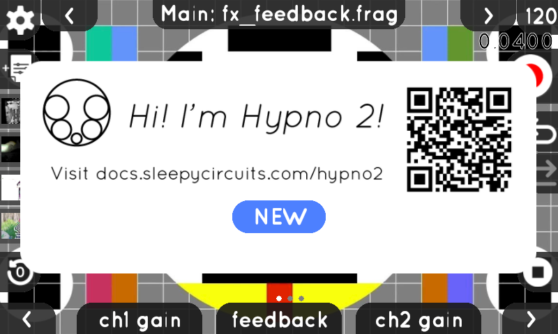<figcaption>
Startup Popup
</figcaption></figure>

Shown on first boot or when previous session data is available.
- **Hypno 2 logo** and QR code linking to docs.sleepycircuits.com/hypno2
- **NEW** button: start a fresh session with default settings
- **RESTORE STATE** button: resume your previous session (only appears when restore data is available)

## Home Screen / Main

<figure><figcaption>
Home Screen
</figcaption></figure>

The main control interface where you spend most of your time.
- **Top bar** (left to right): settings gear icon, left arrow (previous shader), channel title showing track and shader name (e.g. "Main: fx\_feedback.frag"), right arrow (next shader), FPS counter (120), frame time display
- **Left sidebar** (top to bottom): save preset button, up to 4 recent preset thumbnails (tap any to load that preset)
- **Right sidebar** (top to bottom): record button (red circle), undo arrow, redo arrow
- **Bottom left**: reset/init button (restores default parameter values)
- **Bottom center**: 3 parameter knobs — **ch1 gain** (left encoder), **feedback** (center encoder), **ch2 gain** (right encoder)
- **Page dots** above center knob indicate current parameter page position
- **Bottom corners**: left/right page arrows to navigate parameter pages, playback mode button (bottom right)

### Undo/Redo

The undo/redo system tracks up to 100 actions including parameter changes (hardware encoders or MIDI), modulation settings, preset loads with full state restoration, shader changes, resource switches, and playback mode changes. The undo (left arrow) and redo (right arrow) buttons in the right sidebar appear bright when available and dimmed when unavailable.

### Recording

Recording captures visuals at internal display resolution and frame rate with automatic timestamp-based naming. Press the record button (turns red when active) to start, perform your visual sequence, then press again to stop. After completion, choose whether to assign the recording to the active channel for immediate resampling. Recordings save to VIDOS-Resources/Recordings/. Multiple recordings can encode simultaneously — the glowing top bar and Thought Manager (Brain icon) track batch operation progress.

### Presets

Presets save as `.json` files containing complete system state including all parameters, modulation settings, and MIDI mappings. Tap the save button in the left sidebar to save the current state. Tap any of the 4 recent preset thumbnails to instantly load that preset. tap the add preset button at the top to add a new preset. Saved into VIDOS-Resources/Presets folder.

## Mixer & FX (Effect Shader fx_feedback.frag shown)

<figure>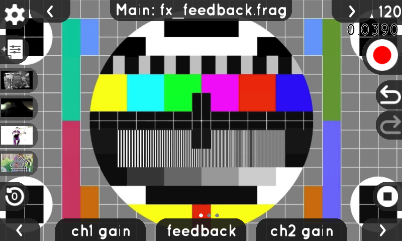<figcaption>
Main — Page 1: Mixer (CC 0-2)
</figcaption></figure>

The Main track (MIDI Channel 16) controls the global mixer and feedback shader (fx\_feedback.frag). The top bar shows "Main:" followed by the FX shader name. These parameters affect how Channels 1 and 2 are blended together and how the feedback loop behaves.

Channel mixing controls — how much of each channel appears in the final output.
- **ch1 gain** (left encoder, CC 0): volume/level of Channel 1 (Track A) in the mix
- **feedback** (center encoder, CC 1): amount of frame-to-frame feedback effect
- **ch2 gain** (right encoder, CC 2): volume/level of Channel 2 (Track B) in the mix

Controls how the feedback frame is transformed before being mixed back in.
- **fb x** (left encoder, CC 3): horizontal offset of the feedback frame
- **fb zoom** (center encoder, CC 4): zoom/scale amount applied to the feedback
- **fb y** (right encoder, CC 5): vertical offset of the feedback frame

Feedback rotation and luminance keying thresholds.
- **fb rotate** (left encoder, CC 6): rotation angle applied to the feedback frame
- **low key** (center encoder, CC 7): low luminance keying threshold — pixels darker than this are keyed out
- **hi key** (right encoder, CC 8): high luminance keying threshold — pixels brighter than this are keyed out

### Video & Audio Mixing

When both audio and video are present you will see 3 badges above that channel's gain: A, &, V 
Each track supports independent gain control on Audio & Video, tap "A" / "V" to controll the corresponding gain, tap "&" to control both at once.

Audio outputs to the default sound device, make sure at least one device is unmuted in Settings->Audio (Out Button)
Audio devices get mixed in with unity (1.) gain. Tap the name of a sound device to assign it to a channel to control it with the mixer gain controls.

Channel Audio be Assigned to:
- **USB Audio Devices**: Unity gain by default, assignable to channels if gain control is desired
- **WAV Files**: Load audio files for synchronized playback with video
- **Capture Card Audio**: Audio from USB capture devices automatically linked to video
- **NDI Audio**: Network audio streams from NDI sources
- **Microphone**: Built-in or USB microphone input

### Audio/Video Playback Modes

Change playback mode by touching the mode button on the home screen.

- **Loop**: mode continuously repeats the video. One-Shot plays once then stops on the final frame. 
- **Bounce**: alternates between forward and reverse. Random selects the next video randomly from the current directory. 
- **Next & Previous**: advance linearly.  Each video channel has independent playback mode settings.
- **Walk**: randomly picks next or previous. 
- **Shuffle**: randomizes the full directory order. 

### Fullscreen Mode

<figure>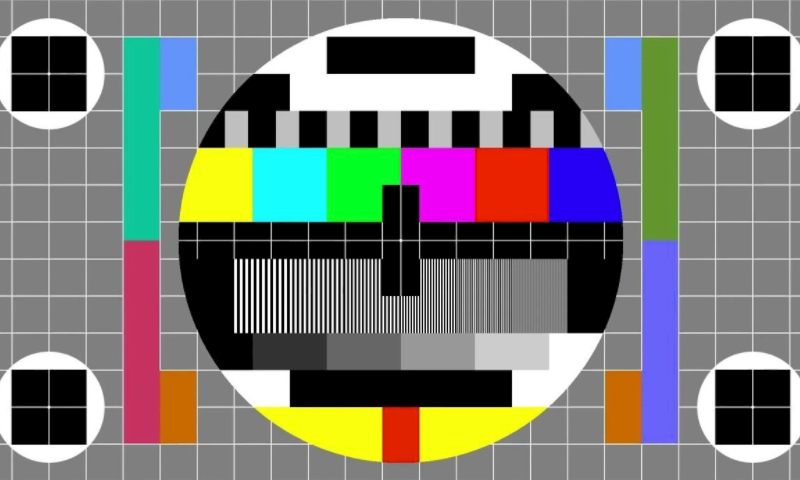<figcaption>
Fullscreen Mode
</figcaption></figure>

Clean video output with all UI elements hidden.
- The shader output fills the entire 800x480 screen
- Touch anywhere on the screen to return to the control interface
- Useful during live performance or when projecting to an audience

## Track A Parameter Pages (Ch 1)

<figure>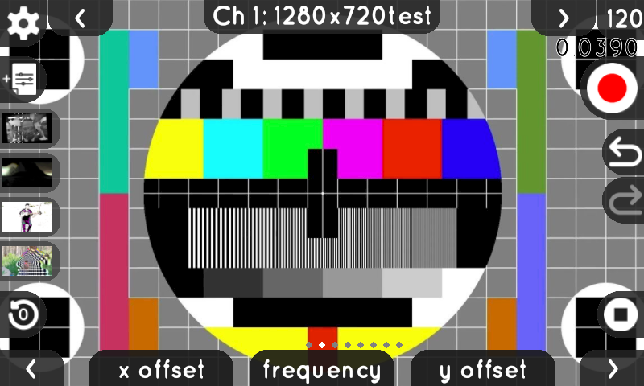<figcaption>
Track A — Page 1 (CC 0-2)
</figcaption></figure>

Track A (Channel 1) parameter pages. The top bar shows "Ch 1:" followed by the loaded shader name. Each page has 3 parameter knobs at the bottom controlled by the left, center, and right hardware encoders. Tap any parameter name to open its modulation menu. "---" indicates an unused parameter slot. Page dots above the center knob show which page you're on. Use the left/right arrows to navigate between pages.

Position and speed controls for Channel 1's shader.
- **x offset** (left encoder, CC 0): horizontal position of the shader pattern
- **frequency** (center encoder, CC 1): speed or frequency of the shader animation
- **y offset** (right encoder, CC 2): vertical position of the shader pattern

Cropping and rotation controls.
- **x crop min** (left encoder, CC 3): left edge of the horizontal crop window
- **rotation** (center encoder, CC 4): rotation angle of the shader output
- **x crop max** (right encoder, CC 5): right edge of the horizontal crop window

Vertical cropping controls.
- **y crop min** (left encoder, CC 6): top edge of the vertical crop window
- **---** (center encoder, CC 7): unassigned slot
- **y crop max** (right encoder, CC 8): bottom edge of the vertical crop window

Aspect ratio controls.
- **aspect x** (left encoder, CC 9): horizontal stretch/squeeze of the output
- **---** (center encoder, CC 10): unassigned slot
- **aspect y** (right encoder, CC 11): vertical stretch/squeeze of the output

Mirror/reflection controls.
- **mirror amt** (left encoder, CC 12): intensity of the mirror effect
- **mirror rot** (center encoder, CC 13): rotation angle of the mirror axis
- **---** (right encoder, CC 14): unassigned slot

Luminance and polarization controls.
- **luma min** (left encoder, CC 15): minimum luminance threshold (darks cutoff)
- **polarization** (center encoder, CC 16): polarization effect amount
- **luma max** (right encoder, CC 17): maximum luminance threshold (lights cutoff)

Cross-modulation and feedback modulation controls.
- **---** (left encoder, CC 18): unassigned slot
- **cross mod** (center encoder, CC 19): amount of cross-modulation between channels
- **fb mod amt** (right encoder, CC 20): feedback modulation depth

Color adjustment controls (OKLab color space).
- **hue** (left encoder, CC 63): hue shift of the shader output
- **chrominance** (center encoder, CC 64): color saturation intensity
- **lightness** (right encoder, CC 65): brightness/lightness of the output


Parameters vary by loaded shader. The CC numbers shown here are defaults — each parameter can be remapped to any CC number (0-127) through the modulation menu.


## Track B Parameter Pages (Ch 2) (Generative shape: sin.frag shown)

<figure>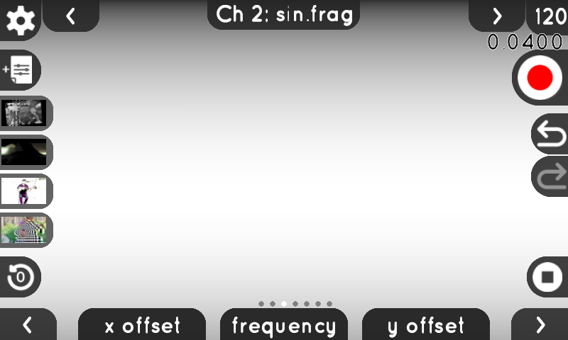<figcaption>
Track B — Page 1 (CC 0-2)
</figcaption></figure>

Track B (Channel 2) uses the same layout as Track A. The top bar shows "Ch 2:" followed by the loaded shader name. Parameters vary depending on which shader is loaded — different shaders expose different controls (sin.frag shown in these screenshots).

Position and speed controls for Channel 2's shader.
- **x offset** (left encoder, CC 0): horizontal position of the shader pattern
- **frequency** (center encoder, CC 1): speed or frequency of the shader animation
- **y offset** (right encoder, CC 2): vertical position of the shader pattern

Folding and rotation controls (specific to sin.frag shader).
- **fold axis** (left encoder, CC 3): axis angle for the folding effect
- **rotation** (center encoder, CC 4): rotation of the shader pattern
- **fold shape** (right encoder, CC 5): shape/intensity of the fold

Aspect and polarization controls.
- **aspect x** (left encoder, CC 6): horizontal stretch/squeeze
- **polarization** (center encoder, CC 7): polarization effect amount
- **aspect y** (right encoder, CC 8): vertical stretch/squeeze

Luminance threshold controls.
- **luma min** (left encoder, CC 9): minimum luminance cutoff
- **---** (center encoder, CC 10): unassigned slot
- **luma max** (right encoder, CC 11): maximum luminance cutoff

Mirror/reflection controls.
- **mirror amt** (left encoder, CC 12): intensity of the mirror effect
- **mirror rot** (center encoder, CC 13): rotation angle of the mirror axis
- **---** (right encoder, CC 14): unassigned slot

Cross-modulation and feedback modulation controls.
- **---** (left encoder, CC 60): unassigned slot
- **cross mod** (center encoder, CC 61): amount of cross-modulation between channels
- **fb mod amt** (right encoder, CC 62): feedback modulation depth

Color adjustment controls (OKLab color space).
- **hue** (left encoder, CC 63): hue shift of the shader output
- **chrominance** (center encoder, CC 64): color saturation intensity
- **lightness** (right encoder, CC 65): brightness/lightness of the output

## Modulation Pages (Parameter label tap)

<figure>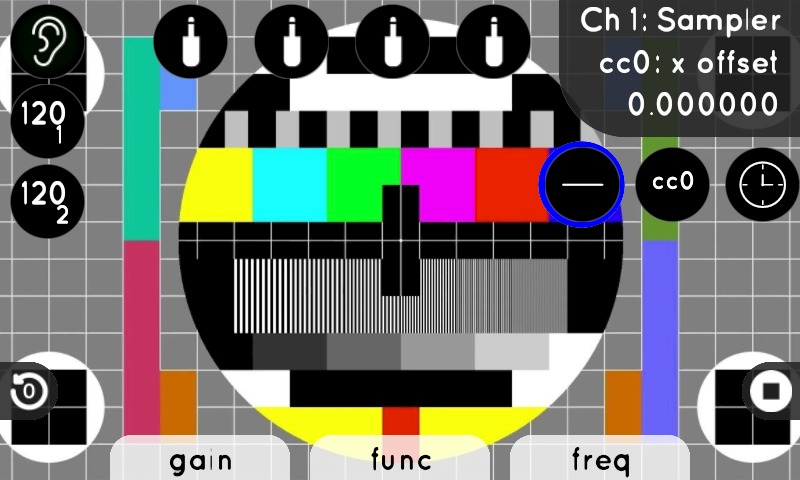<figcaption>
Modulation — Internal LFO
</figcaption></figure>

The modulation menu opens when you tap a parameter name on any parameter page. Each parameter can receive modulation from multiple sources with independent gain control. The header in the top-right displays the channel name, CC number, parameter name, and current value.

The default view shows the internal LFO (Low Frequency Oscillator) modulation source.
- **Top-right header**: "Ch 1: Sampler", "cc0: x offset", and current value (0.000000)
- **Left column badges**: 4 CV input jack icons (with BPM readouts "120" for trigger inputs), ear/audio input badge at bottom
- **Right column badges**: MIDI CC badge ("cc0"), clock badge (clock icon)
- **Bottom row badges**: audio track badges (Ch 1, Ch 2) for using track audio as modulation
- **Blue ring** highlights the currently selected modulation source
- **Bottom knobs**: **gain** (left — modulation amplitude, bipolar), **func** (center — waveform shape selector), **freq** (right — LFO speed)
- Available waveforms: Sin, Cos, Tri, Ramp, Tan, Rnd, Pulse, Exp, Log, StpRnd, Bounce, Chaos, Heart, Pend

The scope renderer provides real-time waveform displays for CV input levels, MIDI CC values, and audio levels. LED-style numeric indicators show precise values for control signals, useful for calibrating modulation depths and monitoring external input.

<figure>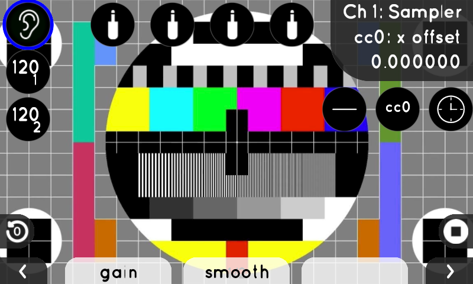<figcaption>
Modulation — Audio Input, Page 1: Gain &amp; Smooth
</figcaption></figure>

Audio input (AUX/microphone) modulation settings, page 1 of 2. The ear badge on the left is selected (blue ring). The built-in microphone provides audio-following modulation with adjustable magnitude (bipolar -1 to +1) and slew rate (0 to 1). If a jack is plugged into aux, the ear is replaced.
- **gain** (left encoder): modulation depth — how strongly audio input affects the parameter
- **smooth** (center encoder): response smoothing — higher values create slower, smoother modulation response

<figure>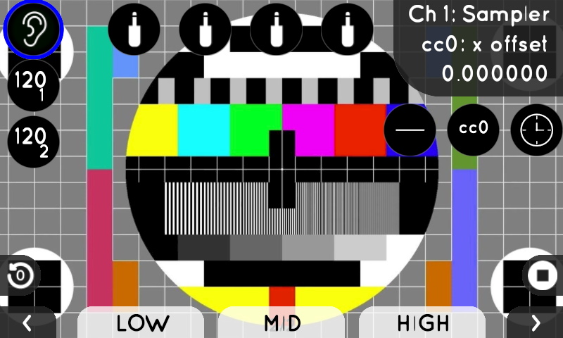<figcaption>
Modulation — Audio Input, Page 2: Frequency Bands
</figcaption></figure>

Audio input frequency band controls, page 2 of 2. Lets you isolate specific frequency ranges.
- **LOW** (left encoder): low frequency band gain (bass response)
- **MID** (center encoder): mid frequency band gain
- **HIGH** (right encoder): high frequency band gain (treble response)
- Colored glow indicators on the badges show real-time band activity (red/green/blue)

<figure>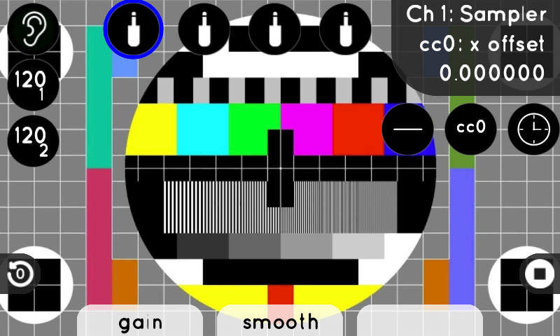<figcaption>
Modulation — CV Input
</figcaption></figure>

Control voltage input modulation settings. One of the 4 CV jack badges on the left is selected (blue ring).
- **gain** (left encoder): modulation depth from the selected CV input jack
- **smooth** (center encoder): input smoothing to reduce noise or jitter on the CV signal
- Select which CV jack (1-4) by tapping the corresponding badge on the left

<figure><figcaption>
Modulation — MIDI CC
</figcaption></figure>

MIDI Control Change modulation settings. The "cc0" badge on the right is selected (blue ring). Each parameter can be remapped to respond to any MIDI CC number between 0-127, independent of its default CC assignment. This allows custom MIDI controller layouts. MIDI mappings save with presets.
- **gain** (left encoder): modulation depth from incoming MIDI CC messages (bipolar)
- **smooth** (center encoder): input smoothing for the MIDI CC signal (0 to 1)
- **cc#** (right encoder): MIDI CC number mapping (0-127) — remap which CC number controls this parameter

<figure>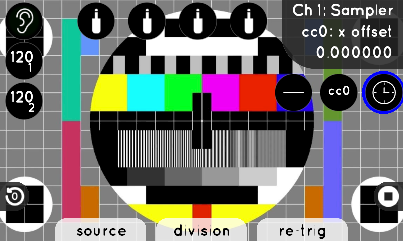<figcaption>
Modulation — Clock/BPM Sync
</figcaption></figure>

Clock and BPM synchronization settings. When BPM sync is enabled, modulation locks to external clock sources through two independent trigger inputs. The trigger interval BPM display converts incoming trigger frequencies to beats per minute readings at 64ppqn, with each trigger input showing its own readout.
- **source** (left encoder): clock source selection — OFF, BPM (internal tempo), CLK1 (trigger input 1), CLK2 (trigger input 2)
- **division** (center encoder): clock division ratio — 1/32, 1/16, 1/8, 1/4, 1/2, 1/1, 2x, 4x, 8x, 16x
- **re-trig** (right encoder): retrigger ON/OFF — resets the LFO phase on each clock pulse

<figure>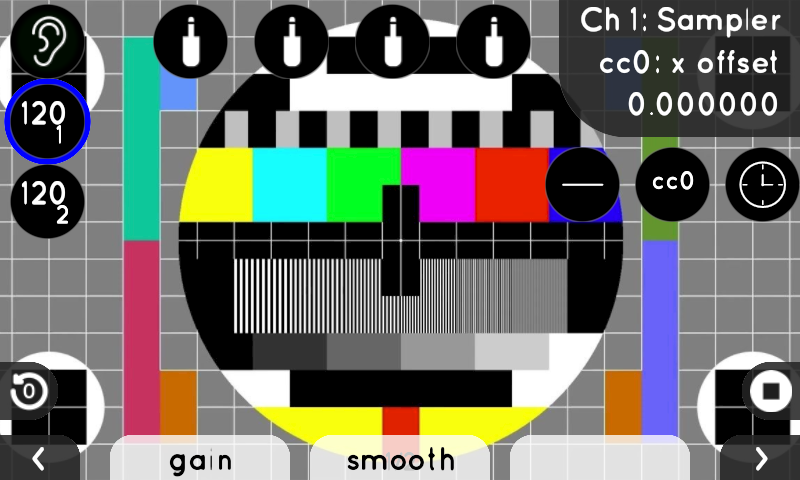<figcaption>
Modulation — Audio Track, Page 1: Gain &amp; Smooth
</figcaption></figure>

Audio track modulation settings, page 1 of 2. Uses audio from a video channel's loaded media as a modulation source. A track badge at the bottom is selected (blue ring, shows BPM readout).
- **gain** (left encoder): modulation depth from the audio track
- **smooth** (center encoder): response smoothing for the audio signal

<figure>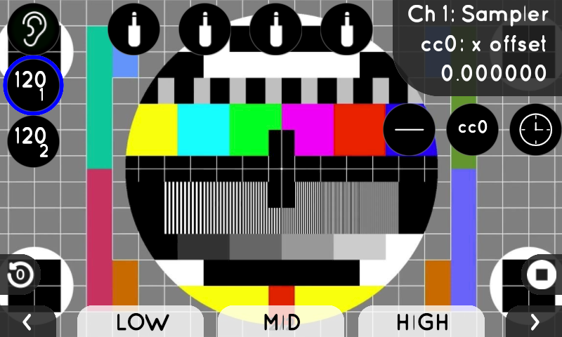<figcaption>
Modulation — Audio Track, Page 2: Frequency Bands
</figcaption></figure>

Audio track frequency band controls, page 2 of 2. Same band controls as the ear/audio input.
- **LOW** (left encoder): low frequency band gain (bass)
- **MID** (center encoder): mid frequency band gain
- **HIGH** (right encoder): high frequency band gain (treble)

## Clock/BPM Page

<figure>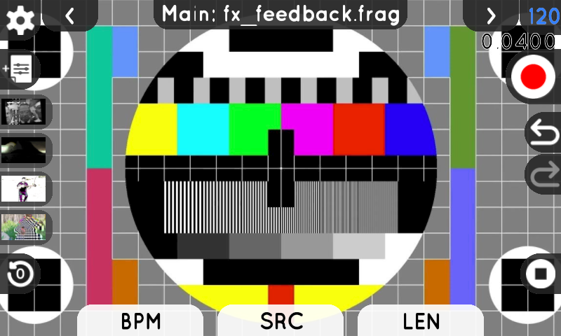<figcaption>
Clock / BPM Settings
</figcaption></figure>

Global tempo and clock configuration. Access this page by taping the bpm value in the top right corner.
- **BPM** (left encoder): set the internal tempo in beats per minute
- **SRC** (center encoder): clock source — OFF (no clock), AUTO (auto-detect), INT (internal clock), EXT (external trigger), CLK (MIDI clock)
- **LEN** (right encoder): sequence length for clock-synced recording start/stop

When Channel 1/2 is selected
- **BPM** (left encoder): set this channel's tempo in beats per minute

## File Browser

<figure>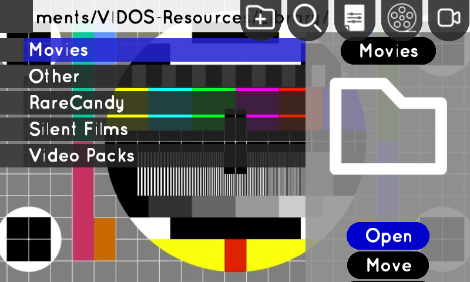<figcaption>
File Browser
</figcaption></figure>

Browse and manage files on internal storage and USB drives. The file browser uses checkboxes for multi-selection with a master checkbox in the header to select/clear all.
- **Top bar** (left to right): current directory path, new folder button (+), search icon (magnifying glass), settings shortcut (gear), sort/view mode icons, camera icon (when USB camera detected)
- **File list** (left side): folders and files displayed as a scrollable list — blue highlight shows the currently selected item
- **Right side**: preview thumbnail of the selected file/folder, name label below the thumbnail
- **Action buttons** (bottom-right): **Open** (navigate into folder), **Move** (relocate files)
- Other actions appear depending on context: **Load**, **Delete**, **Decode**, **Encode**, **Copy**
- Use left encoder to scroll the file list, center encoder for preview, right encoder for actions

The system automatically generates and caches thumbnails for images and videos. File metadata is indexed for faster browsing of large directories. Long filenames scroll horizontally to show the full name. Touch filenames to rename using the virtual keyboard.

## Supported File Formats

### Images
- **JPEG**: Raster images with EXIF orientation support
- **PNG**: Raster images with transparency support
- **BMP, GIF**: Additional raster formats
- **SVG**: Vector graphics rendered at optimal quality, cached at multiple scales for smooth zooming

### Video
- **MP4**: Primary format with H.264/H.265 encoding
- **MOV, WebM**: Additional container formats
- Videos must be decoded before use in channels. Use the file browser to batch decode.

### Audio
- **WAV**: Primary audio format for mixing and playback
- **MP3, OGG, FLAC**: Additional audio formats

### Shaders & Text
- **GLSL (.frag)**: Fragment shaders for custom visual effects with live editing
- **TXT**: Plain text files with syntax highlighting

### File Operations

Select files individually by touching checkboxes, or select all with the master checkbox. Available batch operations include:

- **Move**: Relocate files to another directory with conflict detection
- **Copy**: Duplicate files to another location
- **Delete**: Remove selected files with confirmation
- **Encode**: Convert videos to optimized format for playback
- **Decode**: Prepare videos for channel use
- **Delete Encoded/Decoded Only**: Remove specific versions, keep others

Progress tracking shows real-time progress bars with frame counts and cancellation support. Create new folders by touching the (+) button — this opens the keyboard in folder creation mode with a yellow/orange header.

### USB Drive Management

USB drives mount automatically when connected, with support for multiple partitions. Safe removal ensures proper unmounting.


**Pro Tip**: Use the master checkbox to select all files, then deselect individual files to exclude them from batch operations.



**Important**: Wait for file operations to complete before disconnecting USB drives to prevent data loss.


### Search

<figure>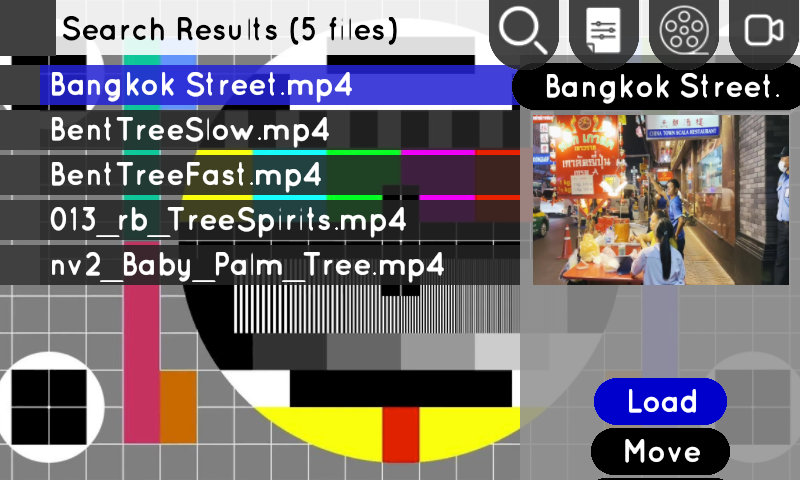<figcaption>
File Browser — Search Results
</figcaption></figure>

Touch the search icon to find files by name. Search results appear asynchronously without blocking the UI.
- **Header**: "Search Results (N files)" showing the number of matches found
- **File list**: matching files listed by name with blue selection highlight
- **Right side**: preview thumbnail of the selected result
- **Action buttons**: **Load** (assign file to the active channel), **Move** (relocate the file)

## Settings

Access settings through the gear icon on the home screen. The settings menu is organized into tabs along the left column.

<figure>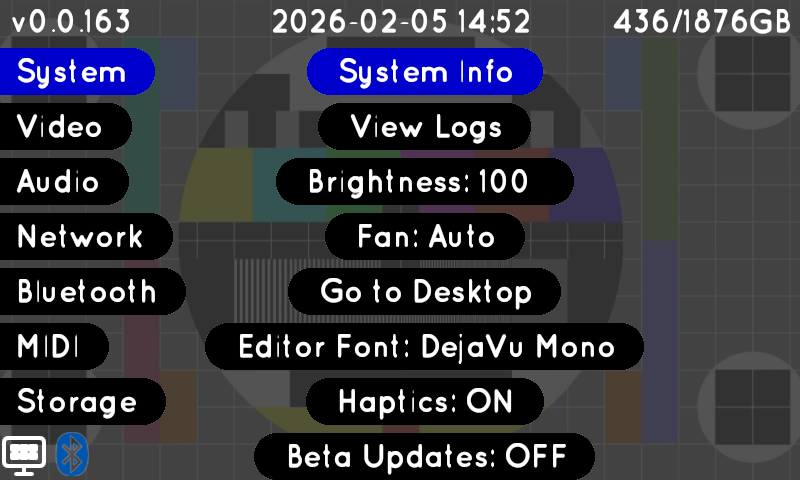<figcaption>
Settings — System
</figcaption></figure>

### System

System information and general device settings.
- **Top bar**: firmware version (v0.0.163), current date/time, storage usage (e.g. 436/1876GB). The version num becomes an update button when new firmware is available.
- **Tab list** (left column): System (selected, highlighted blue), Video, Audio, Network, Bluetooth, MIDI, Storage
- **System Info**: view detailed hardware and software information
- **View Logs**: open the system log file for debugging
- **Brightness: 100**: screen brightness (0-100, tap to adjust)
- **Fan: Auto**: fan control mode (Auto / Off / Max) for silent operation
- **Go to Desktop**: switch to Raspberry Pi desktop mode
- **Editor Font: DejaVu Mono**: cycle through available monospace fonts for the text editor
- **Haptics: ON**: toggle vibration feedback on encoder turns (ON/OFF)
- **Beta Updates: OFF**: opt in/out of beta firmware updates (ON/OFF)
- **Bottom icons**: desktop mode shortcut, Bluetooth quick toggle

<figure>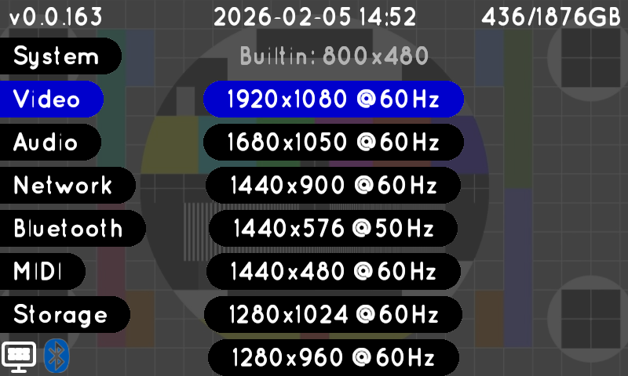<figcaption>
Settings — Video
</figcaption></figure>

### Video

Video output resolution settings for the HDMI display.
- **Builtin: 800x480**: shows the built-in touchscreen resolution (not changeable)
- **Resolution list**: available HDMI output modes detected from the connected display — each entry shows resolution and refresh rate (e.g. 1920x1080 @60Hz)
- **Selected resolution** highlighted in blue, starred item indicates currently selected mode/EDID.
- Tap any resolution to switch the HDMI output to that mode

<figure>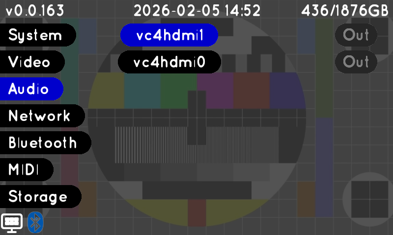<figcaption>
Settings — Audio
</figcaption></figure>

### Audio

Audio output device configuration.
- **Device list**: each audio device shown with its name — "vc4hdmi1" (HDMI port 1), "vc4hdmi0" (HDMI port 0)
- **Out** toggle buttons: enable/disable audio output per device (blue = selected, dark = muted)
- USB audio devices appear in this list when connected, with both **In** and **Out** toggle options
- Track assignment prefixes appear for input devices (M: for Unity Gain, 1: for Track A assign, 2: for Track B assign), tap to rotate assignment

<figure>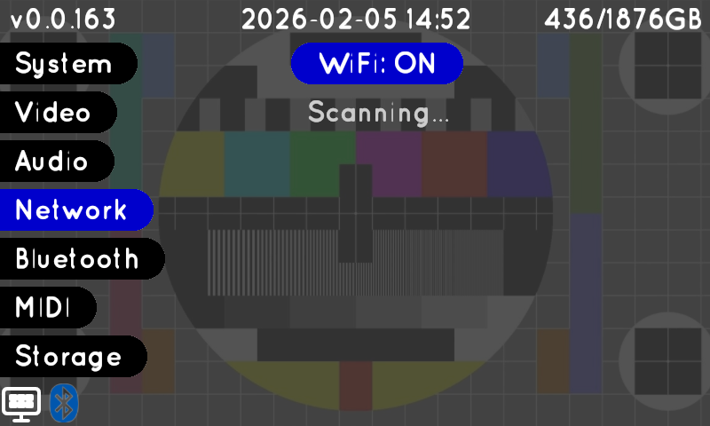<figcaption>
Settings — Network
</figcaption></figure>

### Network

Wi-Fi network configuration.
- **WiFi: ON** toggle button: enable or disable the Wi-Fi radio (tap to toggle)
- **Scanning...** status: the device is actively searching for available networks
- When networks are found, they appear as a list with signal strength indicators
- Tap a network name to connect — a keyboard appears for password entry if the network is secured
- Connected networks show "(Connected)" label

<figure>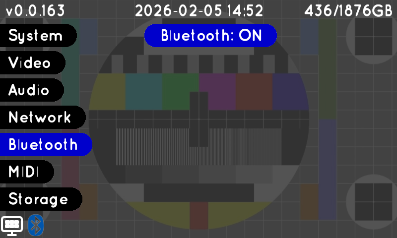<figcaption>
Settings — Bluetooth
</figcaption></figure>

### Bluetooth

Bluetooth device pairing and management. Supports MIDI controllers.
- **Bluetooth: ON** toggle button: enable or disable the Bluetooth radio
- Paired devices appear in a list below with connection status
- Device type prefixes: [MIDI] for MIDI controllers 
- Tap a device to connect, disconnect, or remove the pairing

<figure>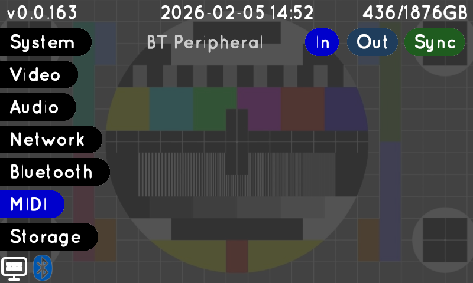<figcaption>
Settings — MIDI
</figcaption></figure>

### MIDI Devices

MIDI device management and routing.
- **Device list**: each connected MIDI device shown by name — "BT Peripheral" is the built-in Bluetooth MIDI (Mezzz controller)
- **In** toggle (blue): enable/disable receiving MIDI input from this device
- **Out** toggle (blue): enable/disable sending MIDI output to this device
- **Sync** toggle (green): enable/disable bidirectional clock/transport synchronization with this device
- Green = enabled, dark = muted/disabled

USB MIDI controllers connect plug-and-play with automatic detection and support for multiple simultaneous devices. For Bluetooth MIDI, enable Bluetooth in Settings, put the controller in pairing mode, and accept the connection when the popup appears.

<figure>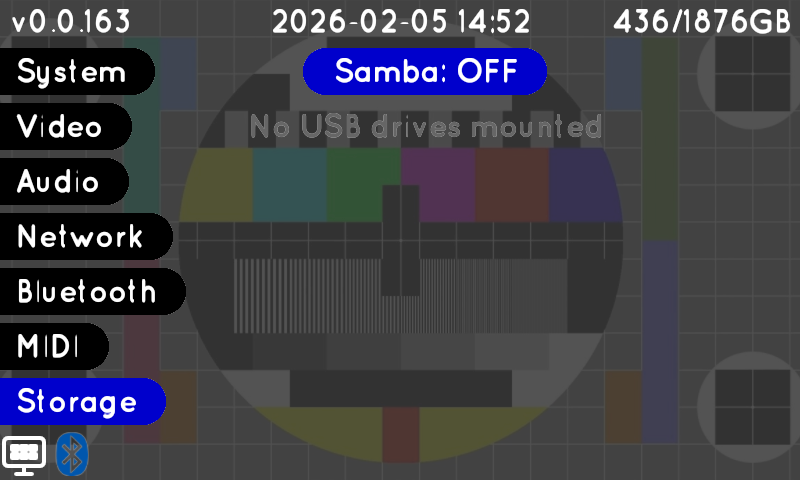<figcaption>
Settings — Storage
</figcaption></figure>

### Storage

Storage and network file sharing settings.
- **Samba: OFF** toggle: enable/disable network file sharing via SMB protocol
- When Samba is on, the SMB share address is displayed (e.g. smb://hypno2.local) for accessing files from a computer on the same network
- **USB drive list**: shows connected USB drives with storage sizes
- "No USB drives mounted" message when no external drives are connected
- Expand Filesystem option appears when additional disk space can be claimed on an SSD (expands partition, do not interrupt this process)

## Hardware Map (Mezzz Integration)

<figure>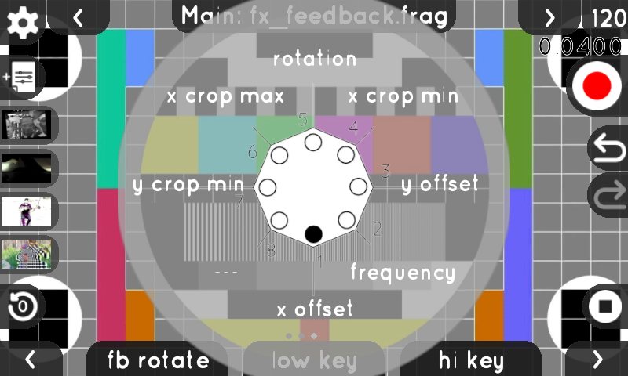<figcaption>
Mezzz Hardware Control Map
</figcaption></figure>

Visual overlay showing how hardware controls map to on-screen parameters. Press the center button on Mezzz to pull up this special map.
- **Center diagram**: circular layout of the Mezzz controller with labeled encoder positions
- **Parameter labels**: each encoder position shows the parameter it currently controls — rotation, x offset, y offset, x crop min, x crop max, y crop min, frequency, etc.
- The overlay renders on top of the live visual output so you can see both the map and the video simultaneously

## Shader Editor

<figure>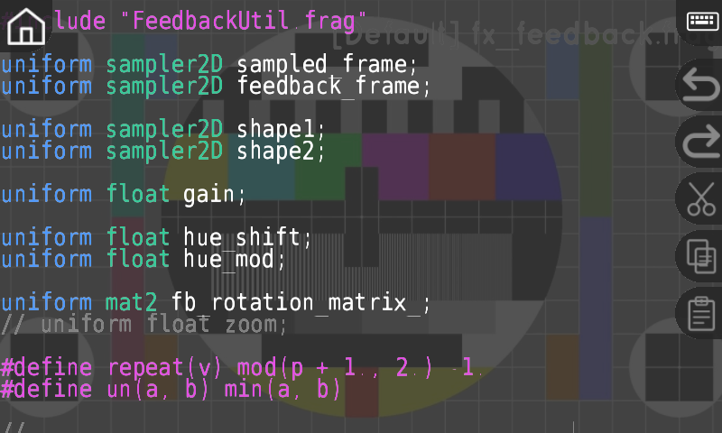<figcaption>
Shader Code Editor
</figcaption></figure>

Built-in GLSL fragment shader editor for creating and modifying custom visual effects. Touch a `.frag` file in the browser to open it in the editor.
- **Code area**: GLSL source code with syntax highlighting — keywords (uniform, float) in different colors, types (sampler2D, mat2) highlighted, values and defines color-coded
- **Line numbers**: displayed on the left margin for easy navigation
- **Filename** shown in top-right corner (fx\_feedback.frag in this screenshot)
- **Right sidebar buttons** (top to bottom): home (return to browser), undo, redo, cut/copy/paste (scissors/clipboard icons), save, close
- Touch the code area to place the cursor, use hardware encoders to scroll, or connect a USB/Bluetooth keyboard for faster editing
- Shader compilation errors are displayed inline when saving
- Comment toggle, indentation control, and multiple font choices (configurable in Settings > Editor Font)

## Keyboard

On-screen keyboard for text input (search queries, file renaming, Wi-Fi passwords, folder names).
- **Header** (green bar): shows the current input mode — "Search Resources" in this screenshot
- **NO** button (top-left): cancel the input and close the keyboard
- **GO** button (top-right): confirm the input and submit
- **QWERTY layout**: three rows of letter keys (q-p, a-l, z-m)
- **Shift**: toggle between lowercase and uppercase letters
- **123**: switch to the numbers and common symbols page
- **#+=**: extended symbols page
- **BKSP**: backspace — delete the character to the left of the cursor
- **Space**: insert a space character
- Hardware encoders move the text cursor left/right for precise positioning

USB keyboards are also supported for faster text entry.

## Live Video Inputs

### USB Cameras & Capture Cards

Connect UVC-compatible video cameras or capture cards via USB for live processing. A camera icon appears in the file browser when a compatible device is detected. The system automatically detects resolution and framerate. Multiple cameras can be connected simultaneously.

USB capture cards with audio inputs are automatically detected and linked to their video counterparts, allowing synchronized audio-video capture from external sources like game consoles, cameras, or other video equipment.

### NDI Network Video

Hypno 2 can receive & send video and audio over your local network using NDI (Network Device Interface). NDI sources are automatically discovered and appear in the file browser. This enables wireless video input from computers, phones, or other NDI-capable devices.

## MIDI Control

MIDI support includes Transport, Clock, Control Change (CC) for parameter control, Note messages for preset save/recall, and per-channel chromatic video triggering.

### Connecting MIDI
Wired - Host, connect via USB Port
Wireless - Bluetooth Central, connect peripherals (such as Mezzz) via the settings menu
Wireless - Bluetooth Peripheral, check in your central device's settings to connect, there should be a device that is called "Hypno 2" visible on nearby BT central compatible hardware (phone, laptop etc.)

### MIDI Transport
MIDI ports with enabled chlock toggle will recieve transport start.stop and clock messages. Control which clock is the driver at any point via the Main BPM Page.

### MIDI Channel Routing

| MIDI Channel | Track | Purpose |
|---|---|---|
| 1 | Track A (Ch 1) | Video synthesizer channel A |
| 2 | Track B (Ch 2) | Video synthesizer channel B |
| 16 | Main / Master | Mixer gains and feedback FX |

### MIDI CC Remapping

Each parameter can be remapped to respond to any MIDI CC number (0-127), independent of its default CC assignment. Access the remapping in the modulation menu by selecting the MIDI CC badge and turning the right encoder to change the **cc#** value. The current mapped CC number displays as "ccX" in the modulation interface. MIDI mappings save with presets, allowing different controller configurations per patch.

### Chromatic Video Playback (MIDI Notes)

MIDI notes on **Channels 1 and 2** control chromatic pitch-shifting of video and audio playback. This turns any MIDI keyboard or sequencer into a chromatic video instrument — each key plays the loaded video/audio at a different pitch and preserves speed (if clock sync is enabled)

**How it works:**
- **Middle C (note 60)** = normal playback speed (no transposition)
- Each semitone above middle C speeds up playback by a factor of 2^(1/12) (approximately 1.059x)
- Each semitone below middle C slows down playback by the same ratio
- One octave up (note 72) = double speed, one octave down (note 48) = half speed
- Range: approximately 4 octaves in either direction

**Behavior:**
- Each **note-on** retriggers the video from its loop start point, so you can rhythmically re-trigger clips
- **Note-off** holds the last transpose value — the video continues playing at the transposed pitch until a new note is pressed
- **Velocity** is used only for note-on/off detection (not mapped to volume or other parameters)
- MIDI Channel 1 controls Track A, Channel 2 controls Track B

| Note | Name | Transpose | Speed Factor |
|---|---|---|---|
| 48 | C2 | -12 semitones | 0.5x (half speed) |
| 54 | F#2 | -6 semitones | 0.71x |
| 60 | C3 (Middle C) | 0 | 1.0x (normal) |
| 66 | F#3 | +6 semitones | 1.41x |
| 72 | C4 | +12 semitones | 2.0x (double speed) |
| 84 | C5 | +24 semitones | 4.0x |

### Preset Save/Load via MIDI Notes

MIDI notes on **Channels 3-16** trigger preset save and load. Each note number (0-127) acts as a preset slot, and each MIDI channel has its own set of slots.

- **Short press** (note-on then note-off): load the most recent preset saved to that note slot
- **Long hold** (hold the note): save the current state to that note slot
- Presets are stored per-channel and per-note in `Resources/Presets/MIDI/`

This allows MIDI sequencers or foot controllers to recall different visual states on the fly during performance.

### Default MIDI CC Map

#### Track A (MIDI Ch 1) & Track B (MIDI Ch 2)

Parameters on Channels 1 and 2 vary by loaded shader. The table below shows common default assignments:

| CC | Parameter | Description |
|---|---|---|
| 0 | x offset | Horizontal position |
| 1 | frequency | Animation speed |
| 2 | y offset | Vertical position |
| 3 | x crop min / fold axis | Horizontal crop left edge (shader-dependent) |
| 4 | rotation | Rotation angle |
| 5 | x crop max / fold shape | Horizontal crop right edge (shader-dependent) |
| 6 | y crop min / aspect x | Vertical crop top edge (shader-dependent) |
| 7 | polarization | Polarization effect amount (shader-dependent) |
| 8 | y crop max / aspect y | Vertical crop bottom edge (shader-dependent) |
| 9 | aspect x / luma min | Horizontal stretch (shader-dependent) |
| 10 | --- | Unassigned (shader-dependent) |
| 11 | aspect y / luma max | Vertical stretch (shader-dependent) |
| 12 | mirror amt | Mirror effect intensity |
| 13 | mirror rot | Mirror axis rotation |
| 14 | --- | Unassigned |
| 15 | luma min | Luminance low threshold |
| 16 | polarization | Polarization amount |
| 17 | luma max | Luminance high threshold |
| 18-59 | (shader-dependent) | Additional shader parameters |
| 60 | --- | Unassigned |
| 61 | cross mod | Cross-channel modulation amount |
| 62 | fb mod amt | Feedback modulation depth |
| 63 | hue | OKLab hue shift |
| 64 | chrominance | OKLab color saturation |
| 65 | lightness | OKLab brightness |
| 66-127 | mod CC 0-61 | Modulation LFO control (mod CC = base CC + 66) |


When a **Sampler** shader is loaded with multi-frame video, CCs 0-2 are reserved for **loop in**, **framerate**, and **loop out** controls. Shader parameters shift to start at CC 3.


#### Main / Master (MIDI Ch 16)

| CC | Parameter | Description |
|---|---|---|
| 0 | ch1 gain | Track A video level in the mix |
| 1 | feedback | Frame-to-frame feedback amount |
| 2 | ch2 gain | Track B video level in the mix |
| 3 | fb x | Feedback horizontal offset |
| 4 | fb zoom | Feedback zoom/scale |
| 5 | fb y | Feedback vertical offset |
| 6 | fb rotate | Feedback rotation angle |
| 7 | low key | Luminance keying low threshold |
| 8 | hi key | Luminance keying high threshold |

## Desktop Mode (Raspberry Pi OS)

Switch to desktop mode through Settings > "Go to Desktop" to access the Raspberry Pi operating system. In this mode the hardware controls are remapped for desktop navigation:

**Encoders:**
- Left encoder: mouse X movement
- Center encoder: mouse scroll wheel
- Right encoder: mouse Y movement

**Encoder taps:**
- Left encoder tap: right mouse click
- Center encoder tap: middle mouse click
- Right encoder tap: left mouse click

**Buttons:**
- Left button: ESC key
- Center button: SPACE key
- Right button: ENTER key
- Left + Right buttons simultaneously: F11 fullscreen toggle

This allows full desktop navigation without external peripherals. Useful for recovery or general hacking, comes pre loaded with useful open source software.

### SD Card Copier (Copy SSD)
If upgrading to a different SSD you can use this utility + an M.2 NVMe USB reader to copy out your ssd to a larger drive. When rebooting to vidos, look for an "Expand Filesystem" button in settings to utilize all the new space.

### Returing to VIDOS
Open the "VIDOS" desktop shortcut to reboot system back into the normal Hypno 2 Video Operating system.


Need help? Check the [FAQ](hypno-2-faq.md) or [Troubleshooting Guide](hypno-2-troubleshooting.md)

