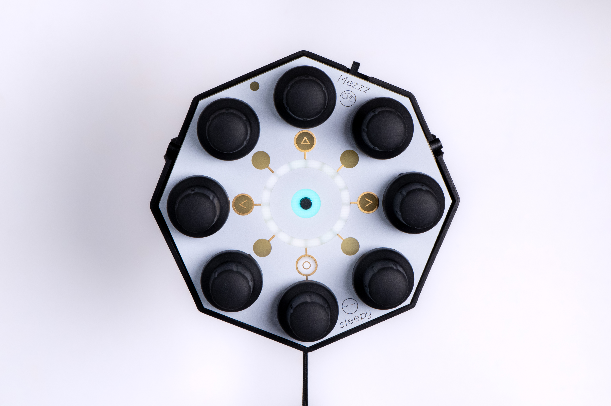

# Mezzz Press Release


[​​DOWNLOAD THE MEZZZ PRESS KIT](https://www.dropbox.com/sh/xarur1goz6a2k97/AADO16mPzQ5wkk4y4EXtj3pLa?dl=1)


<figure><figcaption></figcaption></figure>

<figure><figcaption></figcaption></figure>

## Sleepy Circuits has announced their latest device, [_Mezzz_](https://sleepycircuits.com/mezzz), a portable handheld haptic wireless MIDI talisman that fits in the palm of your hand.

Mezzz can control over 1,000 CC messages via Bluetooth MIDI. It is class-compliant and works with hundreds of Bluetooth-enabled devices. Mezzz is easy to pair and boasts more than four hours of battery life. Mezzz features haptic-enabled encoders which make a buzz for each MIDI value and stop buzzing when you have reached the end of the MIDI CC range. Clip Mezzz to your belt or bag and bring it everywhere – shows, cafes, parks, studios or wherever your next adventure takes you!

## Feature Highlights

### Bluetooth Connectivity

Fully class-compliant and working with hundreds of Bluetooth MIDI enabled devices. Even older non Bluetooth devices can easily be adapted to wireless MIDI with third party hardware.

### Eight Haptic Encoders

Mezzz buzzes as you change parameters, and when you reach the end of the parameter, it stops, giving immediate physical feedback. This approach brings some of the benefits of analog potentiometers to digital encoders and allows intuitive control without having to look down.

### Daylight Readable LED "eye" display

The LED 'eye' ring indicates the parameter position and the current page of parameters you're currently on with its daylight-readable LEDs.&#x20;

### Orientation/Gesture Control (Inertial Momentum Unit)

Twist and move to the music and watch the shapes follow on the screen! The Inertial Momentum Unit uses AHRS sensor fusion to give you dynamic gestural control.

### Side Buttons and Context Sensitive Center "Action" Button

Easily change the MIDI channel you’re on, and use button combinations to quickly randomize any CC message or reset a parameter back to its default state.

### Hang-able, Pocketable and Fashionable

A carabiner and wrist strap is included so you can take Mezzz anywhere and look good doing it!

### >4 hours of Battery Life

USB-C Charging and long-lasting battery life allows true wireless freedom.

### Includes vidOS - a Cross-Platform Video Synthesis Companion App

A 3D evolution of Hypno's engine, available on macOS, iOS, and iPadOS. Once released this app will be free for all midi users and eventually feature premium in-depth visuals systems from the sleepy lab.

_**Mezzz is available for preorder now and will be shipping late November!**_
